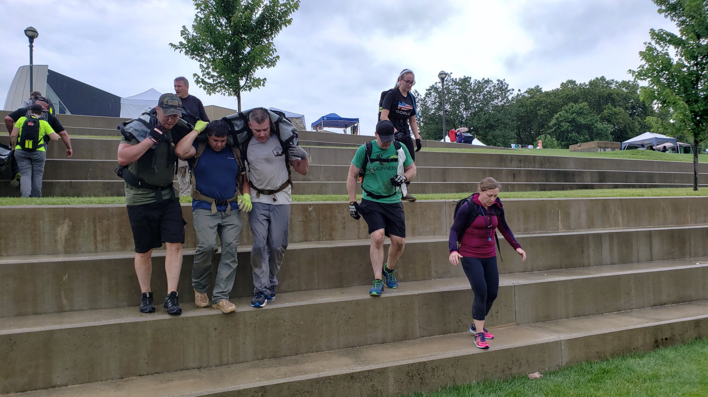

# Battle of Ramadi - Light - Columbus, OH

## Index
- [Battle of Ramadi - Light - Columbus, OH](#Battle-of-Ramadi---Light---Columbus-OH)
  - [Index](#Index)
  - [Training](#Training)
  - [Event Background](#Event-Background)
  - [Packing List](#Packing-List)
    - [Gear](#Gear)
  - [Event Location](#Event-Location)
  - [The Event](#The-Event)
    - [Admin](#Admin)
    - [Welcoming Party](#Welcoming-Party)
  - [Endex](#Endex)
    - [Lessons Learn](#Lessons-Learn)
    - [What's Next?](#Whats-Next)

## Training
This was my very first GORUCK event. I had received my 21L GR1 as a birthday gift almost a year prior and had decided it was time to use it as it was intended! Training consisted of: February 2019 Monthly GORUCK challenge of rucking a mile a day, increasing weight each week. April 2019 Monthly GORUCK challenge with 7 tough workouts in the month. Then about 6 weeks out I started GORUCK's light training guide [here](https://content.goruck.com/site-content/training-plans/light-training-plan.pdf). For the most part I trained with a 20lb GORUCK plate, usually not much more than that (not ideal!). I ended most my training with a 9 mile trail ruck the Thursday prior to the event. Then the week of I did some small rucks and light PT ending Wednesday night.

## Event Background
This event focus on the events that happened during the Battle of Ramadi in 2006 in Ramadi, Iraq. To prepare I watched an [interview with Jocko Willink on Retaking Ramadi](https://youtu.be/vzw71EiIH4o). I learned one of the biggest strategies of this battle was “seize, clear, hold, and build”. This helped truly turn the region around and establish trust. Instead of taking over, clearing out the bad guy, and moving on the idea was to clear them out, establish the area, build it up, and give the area a chance to grow again.

## Packing List
### Gear
* [SALOMON Men's Xa Pro 3D Trail Runner](https://www.amazon.com/Salomon-Trail-Running-Shoes-black/dp/B01HD6SXWA/ref=pd_rhf_ee_s_rp_c_0_8?_encoding=UTF8&pd_rd_i=B01HD6SXWA&pd_rd_r=0b5cf26b-aea4-4b56-88ec-053ae5091a77&pd_rd_w=tnevL&pd_rd_wg=vvIJG&pf_rd_p=e7de3e41-8621-46b5-8090-e75951bb9b3e&pf_rd_r=BVGQXQYTCJVR1FEYFR5H&psc=1&refRID=BVGQXQYTCJVR1FEYFR5H)
* Reebok No Show socks
* [Gerry Men's Venture Flat Front Stretch Cargo Short](https://www.amazon.com/dp/B07CNWT1RR/ref=twister_B07CNV573K?_encoding=UTF8&psc=1)
* Under Armour Shirt
* Cabelas American Flag Hat
* 21L GR1 w/Sternum Strap & Hip Belt
  * [20lb Ruck Plate](https://www.goruck.com/ruck-plates-for-gr1/)
  * [3L Bladder](https://www.amazon.com/gp/product/B016SSZD3G/ref=ppx_yo_dt_b_search_asin_title?ie=UTF8&psc=1)
  * 32oz Gatorade (Frost for the win!)
  * [White Reflective Bands](https://www.amazon.com/gp/product/B000KGATL4/ref=ppx_yo_dt_b_search_asin_title?ie=UTF8&psc=1)
  * [25kN Carabiner](https://www.amazon.com/gp/product/B073XS2KLJ/ref=ppx_yo_dt_b_search_asin_title?ie=UTF8&psc=1)
  * [Small Dry Box](https://www.walmart.com/ip/Outdoor-Products-Small-Watertight-Dry-Box-Orange/36547547?athcpid=36547547&athpgid=athenaItemPage&athcgid=null&athznid=PWVUB&athieid=v0&athstid=CS020&athguid=2a5b1dea-8c3-16d22c369dadec&athancid=null&athena=true)
  * Two Cliff Bars
  * Gloves (plus one Spare Pare)

## Event Location
>[Scioto Audubon Metro Park, Columbus, OH](https://goo.gl/maps/cmw8Nfb7EbAd5Av56)

## The Event
Showed up about 15 minutes before start time and saw a small group assembling of that looked to be fellow Ruckers. I had done a little bit of research on Cadre Igor prior to the event and saw he posted that morning a picture of the Ranger tab setting on his car at the park. Sure enough there it was. I was in the right place.
### Admin
We gathered in an open area and the admin phase kicked off: roll call, identify service members/LEO/EMT in the group, and ask about any health concerns the Cadre should know about.
### Welcoming Party
The fun kicked off with about 20 minutes of PT called out by the Cadre and the cadence lead by the newly appointed Team Leader (TL) and Assistant Team Leader (ATL). 

Next the Cadre created a couple 120lb sandbag casualties using a [tarp like unit](https://www.amazon.com/Medical-Mover-1000-Portable-Transport/dp/B00URFK4PE/ref=pd_cp_328_1?pd_rd_w=oBCl6&pf_rd_p=ef4dc990-a9ca-4945-ae0b-f8d549198ed6&pf_rd_r=HNRY326HKR8F1XDA9C15&pd_rd_r=52ab7991-21dd-44db-af8d-ef41be7e7d2b&pd_rd_wg=H3PgW&pd_rd_i=B00URFK4PE&psc=1&refRID=HNRY326HKR8F1XDA9C15) for us to carry through the obstacle course! I thought of the challenge, but man it sounded like fun, and I was pumped. We split into two teams and had to get our casualty through the course without dropping them. Here are some pictures of the fun:

Then we headed over for some bridge crossing:

Took a little break to refill water and answer a quiz. Each correct answer removed one, each wrong added one to our up and back of "stairs". We did pretty good and ended up with 8. Then we took our sandbag casualties over to the stairs and got to work. Started as full teams, then switched to a 3 man system to knock a few out quickly.

We then rucked through the Columbus Pride parade that was going on that weekend, up to the Veteran's memorial for quick break and discussion before heading over to Goodale park for some team fun, and an 8 legged race!

Then we turned back, at this point about 4 miles out I am guessing. We thankfully got to drop a 60lb sandbag during this time hack. Our last PT was 260 pushups! Mess up count and we would start over. Thankfully it was as a team going down and back counting. After a couple false starts, we actually made it all the way through. Oh yeah it decided to pour down rain during this.

Reward for getting through the pushups, we got to dump another sandbag! Less coupons at this point was more than welcome! We made it back to the start point, with everyone in high spirits. I was super pumped, as this was my first and didn't know what to expect, so to know I was about to complete this crazy thing was incredibly satisfying! We dropped the rest of the sandbags in the near by sand courts then got back where we started about 6 hours ago (under promise, over deliver!). We covered stats and ended up doing a little over 8 miles, carried lots of coupons, and agreed came together as a pretty decent team. Queue the patches and beer!

## Endex
### Lessons Learn
* Pack you bag early in your training to see how much you should train with. I was a little surprised to see my Ruck was around 35lbs once packed. I had only really trained with 20lbs. I think I made it through on adrenaline :)
* Train with sandbags or heavy things like them. I never carried a sandbag before this. The 80lb sandbag opened my eyes! I surprised myself and carried it on a regular rotation with the team. Side note I had some sore ribs in the days afterwards!
* TL & ATL should help the team by focusing them on objectives, which likely means not carrying coupons.
* Consider pants, I wore short and got some scraps crawling on the ground. Pants may have helped a little bit. Then again don't wear something you won't be comfortable and able to move in.
### What's Next?
* I am hooked. I am searching for the next event. Going for one more light before a tough. Let the fun begin!
