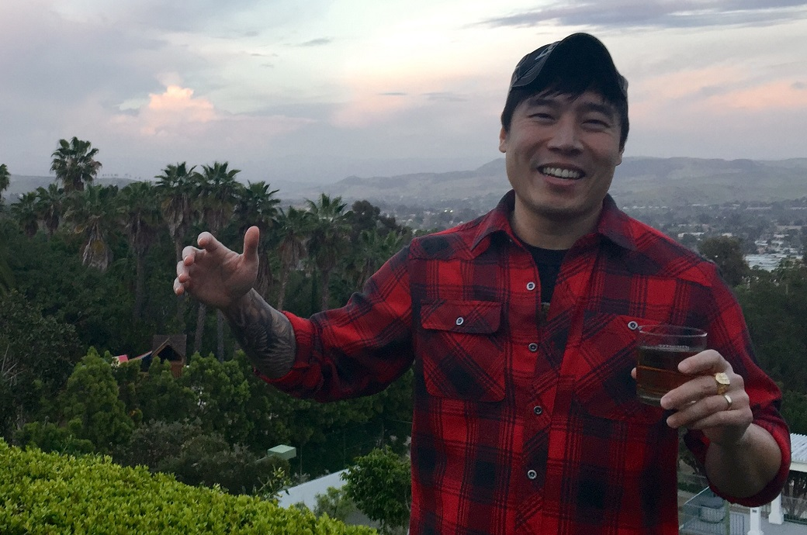
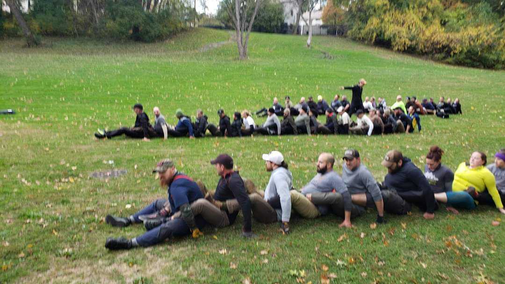

# Battle of Fallujah - Light - Cleveland, OH
10-27-2019

## Index
- [Battle of Fallujah - Light - Columbus, OH](#battle-of-fallujah---Light---cleveland-oh)
  - [Index](#index)
  - [Event Background](#event-background)
  - [Packing List](#packing-list)
    - [Gear](#gear)
  - [Event Location](#event-location)
  - [Cadre](#cadre)
  - [The Event](#the-event)
    - [Admin](#admin)
    - [Welcoming Party](#welcoming-party)
    - [Movement](#movement)
    - [Endex](#endex)
  - [Lessons Learned](#lessons-learned)
  - [What's Next?](#whats-next)

## Event Background
Marines don’t know how to spell the word defeat.” 
— Gen. James Mattis

When his Marines arrived in Iraq in 2003, Gen. Mattis spoke those words to live by in an asymmetrical battle-space. The Second Battle of Fallujah was a joint American, Iraqi, and British offensive at the end of 2004 and the locus of some of the heaviest urban combat U.S. Marines have seen since the Battle of Huế City in 1968 Vietnam. Fallujah was occupied by fighting virtually every insurgent group in Iraq at the time and the battle proved to be the bloodiest of the war. This event will remember the Marines and other coalition forces who fought in this renown battle.

## Packing List
### Gear
* [SALOMON Men's Xa Pro 3D Trail Runner](https://www.amazon.com/Salomon-Trail-Running-Shoes-black/dp/B01HD6SXWA/ref=pd_rhf_ee_s_rp_c_0_8?_encoding=UTF8&pd_rd_i=B01HD6SXWA&pd_rd_r=0b5cf26b-aea4-4b56-88ec-053ae5091a77&pd_rd_w=tnevL&pd_rd_wg=vvIJG&pf_rd_p=e7de3e41-8621-46b5-8090-e75951bb9b3e&pf_rd_r=BVGQXQYTCJVR1FEYFR5H&psc=1&refRID=BVGQXQYTCJVR1FEYFR5H)
* Darn Tough Endurance 1/4 high
* Eddie Bauer Trek Pants
* 32 Degree base layer
* GORUCK MACV SOG T Shirt
* Fila Grid Fleece (Can barely tell it's not GORUCK and for $10!)
* HeadSweat Beanie
* 20L Rucker w/Sternum Strap & Hip Belt
  * [20lb Ruck Plate](https://www.goruck.com/ruck-plates-for-rucker/)
  * [3L Bladder](https://www.amazon.com/gp/product/B016SSZD3G/ref=ppx_yo_dt_b_search_asin_title?ie=UTF8&psc=1)
  * Nalgene 
  * [White Reflective Bands](https://www.amazon.com/gp/product/B000KGATL4/ref=ppx_yo_dt_b_search_asin_title?ie=UTF8&psc=1)
  * [25kN Carabiner](https://www.amazon.com/gp/product/B073XS2KLJ/ref=ppx_yo_dt_b_search_asin_title?ie=UTF8&psc=1)
  * [Pelican 1060 Micro Case](https://www.amazon.com/gp/product/B0029Q7A1K/ref=ppx_yo_dt_b_asin_title_o00_s00?ie=UTF8&psc=1)
    * Two Cliff Bars
    * NUUN Tablets
    * First Aid Kit
  * Gloves
  * Black Diamond headlamp

## Event Location
>[Edgewater Park, Cleveland, OH](https://goo.gl/maps/DvUJMbUW7e8XV6Xn7)

## Cadre
Cadre Igor

Cadre Doug

## The Event

### Admin
We had 52 folks show up! A little under half STILL chasing their bolts and had completed their Tough and Heavy already that weekend.

### Welcoming Party

Weather was in the mid 50s with the sun poking through the clouds. All of the those chasing their HTL bolts lead the welcoming party, each choosing an exercise for everyone circle around them to do. Personal favorite was the Star Gazers :) We then chose a TL and ATL that were new to a GORUCK event. They had the tough job of wrangling HTL'ers and TL'ers that were running on fumes and ready to celebrate. Not going to lie, dropping down to the 20lb weight made a huge difference along with the weather and I was comfortably cruising at this point. Not grey manning, but just good to go and feeling great.

### Movement

We moved towards a nice park with a good size hill in front of us as we formed up. We were to split into 3 teams in which would, in pairs, run a 80lb sandbag up the hill then backwards bear crawl down tagging the next pair to bear brawl up the hill and run the sandbag back down. The relay would continue until everyone finished, and it paid to be a winner. Luckily my team won and we cheared on the others as they paid with some pushups.

Proof I carry weight! That's my black and red Rucker and a 120lb Sandbag on my shoulders.

Around this time we found some logs to carry. We then stopped at a pond to do flutter kicks over the water. 

We also did the most frustrating thing I have done at an event, Dragon Boat races. This simple movement with the team tied interlaced between each other legs resulted in my team moving about 10 feet total in about 10 minutes! It was hilarious to watch, I am sure of that!

The next PT was a VERY LARGE group PT of pushups. We formed a giant triangle and counted off. Each side of the triangle had a number 1, 2, 3, etc. Each Number would do pushups together and yell out the current number and then on the next tuple down and back as a group until we got to 520! We had a couple mess up early on but self corrected and got it done! It was pretty impressive if I must say so myself.

We then made a stop to talk about the events of Fallujah and had the privilege of having someone who served during the battle along with a couple others who had close friends/family serve in it. This was very moving and really drove home the reason we do these events, to put out in honor of those men and women and keep the story alive.

Heading to endex Cadre Igor asked for some motivated individuals to move the team for a tight time hack. We had dumped most if not all weight at this point. We ended up with one of the HTLers as a Team Lead and he got us moving! We did the last stretch, guessing about a mile and a half as a team run/shuffle. The TL stood in the back and tap the last two in our two column moving formation to get to the front. Once they got there he tapped the next two and so on. We made great time and it was pretty fun honestly.

### Endex

Here we formed up again, thinking we were done. We were wrong we had some PT to put out before calling it. We laid interlaced on our backs to pass a person down the group (back into 3 groups for this) using just our hands to pass them down. This was tough and it was dark already making all the more interesting! 

Queue the patch and beers then watch the extra bit of fun the HTLers had to pass through to finally get those bolts!

## Lessons Learned

* Completed my first Tough/Light weekend! It is possible
* Get through the Tough and it's down hill from there.
* I am competitive no matter what I have been through. I sprinted up that hill with the sandbag and my partner, and was quick to move to the front when it was my turn on the way back to endex. Always a motivation to not loose!
 
## Stats
 
  
## What's Next?
* Star Course 12 Miler in Nashville, TN with the Wife!
