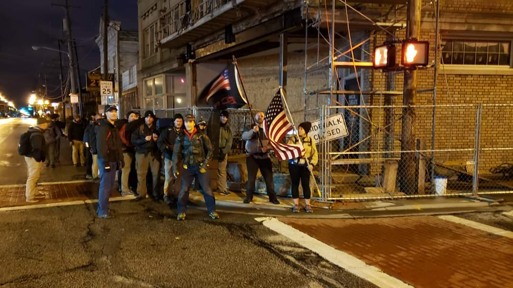
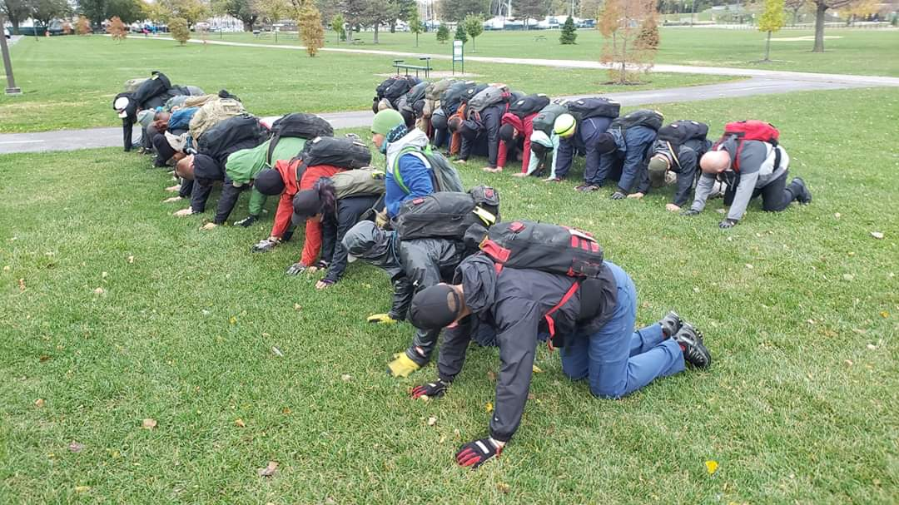
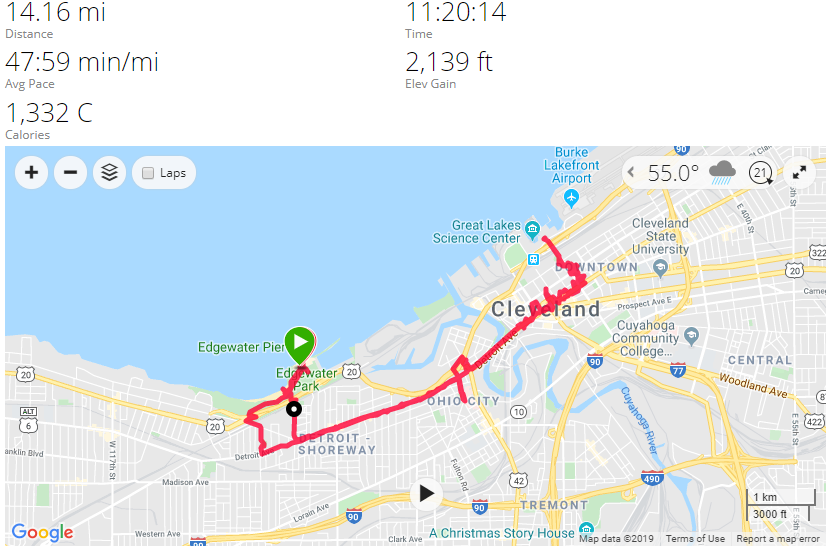

# Battle of Fallujah - Tough - Cleveland, OH
10-26-2019

## Index
- [Battle of Fallujah - Tough - Columbus, OH](#battle-of-fallujah---tough---cleveland-oh)
  - [Index](#index)
  - [Event Background](#event-background)
  - [Packing List](#packing-list)
    - [Gear](#gear)
  - [Event Location](#event-location)
  - [Cadre](#cadre)
  - [The Event](#the-event)
    - [Admin](#admin)
    - [Welcoming Party](#welcoming-party)
    - [Movement](#movement)
    - [Endex](#endex)
  - [Lessons Learned](#lessons-learned)
  - [What's Next?](#whats-next)

## Event Background
Marines don’t know how to spell the word defeat.” 
— Gen. James Mattis

When his Marines arrived in Iraq in 2003, Gen. Mattis spoke those words to live by in an asymmetrical battle-space. The Second Battle of Fallujah was a joint American, Iraqi, and British offensive at the end of 2004 and the locus of some of the heaviest urban combat U.S. Marines have seen since the Battle of Huế City in 1968 Vietnam. Fallujah was occupied by fighting virtually every insurgent group in Iraq at the time and the battle proved to be the bloodiest of the war. This event will remember the Marines and other coalition forces who fought in this renown battle.

## Packing List
### Gear
* [SALOMON Men's Xa Pro 3D Trail Runner](https://www.amazon.com/Salomon-Trail-Running-Shoes-black/dp/B01HD6SXWA/ref=pd_rhf_ee_s_rp_c_0_8?_encoding=UTF8&pd_rd_i=B01HD6SXWA&pd_rd_r=0b5cf26b-aea4-4b56-88ec-053ae5091a77&pd_rd_w=tnevL&pd_rd_wg=vvIJG&pf_rd_p=e7de3e41-8621-46b5-8090-e75951bb9b3e&pf_rd_r=BVGQXQYTCJVR1FEYFR5H&psc=1&refRID=BVGQXQYTCJVR1FEYFR5H)
* Darn Tough Endurance 1/4 high
* [Prana Stretch Zion Pant](https://www.prana.com/p/stretch-zion-pant/M4ST30116-CAGR-28.html?bvstate=pg:2/ct:r&mid=paidsearch&eid=google&gid=6&nid=CPCS_Search_Brand_DSA&oid=Product_Detail_Pages&gclid=EAIaIQobChMItem1xoCs5gIVjIbACh3gagz6EAAYAiAAEgI_D_D_BwE)
* Under Armour Coldgear Base
* GORUCK Spearhead T Shirt
* North Face Rain Jacket
* GORUCK Tac Hat w/American Flag Patch
* 20L Rucker w/Sternum Strap & Hip Belt
  * [30lb Ruck Plate](https://www.goruck.com/ruck-plates-for-rucker/)
  * [3L Bladder](https://www.amazon.com/gp/product/B016SSZD3G/ref=ppx_yo_dt_b_search_asin_title?ie=UTF8&psc=1)
  * Nalgene 
  * [White Reflective Bands](https://www.amazon.com/gp/product/B000KGATL4/ref=ppx_yo_dt_b_search_asin_title?ie=UTF8&psc=1)
  * [25kN Carabiner](https://www.amazon.com/gp/product/B073XS2KLJ/ref=ppx_yo_dt_b_search_asin_title?ie=UTF8&psc=1)
  * [Pelican 1060 Micro Case](https://www.amazon.com/gp/product/B0029Q7A1K/ref=ppx_yo_dt_b_asin_title_o00_s00?ie=UTF8&psc=1)
    * Two Cliff Bars
    * NUUN Tablets
    * First Aid Kit
  * Gloves
  * Black Diamond headlamp

## Event Location
>[Edgewater Park, Cleveland, OH](https://goo.gl/maps/DvUJMbUW7e8XV6Xn7)

## Cadre
Cadre Igor

Cadre Doug

## The Event

### Admin
We had 31 folks show up, about half chasing their bolts and had completed their Heavy a few hours before.

### Welcoming Party

Weather was in the 50s but a steady mist and windy as hell. Looking back it looks like gusts were up to 30mph. We were right off the shores of Lake Erie so we felt all of the suck. We formed up and did the usual pushups, situps, flutter kicks, overhead press, etc. for about 30 minutes. 

We then paired up with "someone your size" (the words still haunt me). I paired up with another giant and then learned we were doing firemen carries down and back for about 200 yards. My partner tossed me on his shoulders and sprinted, easily beating the rest of the group. My turn, this was my first time doing these, so I bent to the side and got him on my shoulders and shakely walked down and back feeling like I could snap in half at any moment! Then we had a small movement to the beach. Here we did bear crawls, sprints, crab walks, inch worms, and anything else that could help the sand get in every crevice. We then assigned TL & ATL and were tasked with filling up the sandbags. 

Chaosed ensued as fillers lost sandbags, zippers got caked in sand, and all hope was lost. We had to dump them all in a pile and sort them back out. Then we ran to the water and looked at it. Folks from the Heavy knew what was coming next, the part were we get in. Gracefully we did not get in and ran back. Probably because we were already soaked from the rain. We then had a small group clean and fill sandbags while everyone else did the deck of death. After what felt like forever we got everything filled and formed up to move out.

### Movement

We headed to the Rock and Roll Hall of Fame with the weight crushing us the whole time. Those 120s provide maximum opportunity to Embrace the Suck. 

From the Rock and Roll Hall of Fame we moved to a city center with a statue of Horse Soldiers to talk more about the battle before heading to a nearby park.

In our first park we did some group exercises where as a team we had to do 320 situps with a time hack to drop some sandbags, we missed the time hack and doubled down on 320 pushups and a smaller time hack and pushed to make it happen.

We then moved out to another park as daylight approached, here we did low crawl races while split into two teams. Had to get a 80lb, 60lb, and 40lb sandbags to the other side while low crawling. Winner was the team that got Sandbags and all members across the line. 

We got the sandbags over quickly but had a couple members feeling the last 8 hours of beat down. Myself and a couple others low crawled back to help them across the line. We lost, but we didn't leave people behind. Cadre saw this and lessoned our punishment. Sun was up at this point and we proceeded back to Endex.

### Endex

Here we formed up again, thinking we were done. We were wrong we had some PT to put out before calling it. Tunnel of Love!

Best part was as you got to the end the Cadre was waiting to help you up, patch in hand! Great way to finish it!

## Lessons Learned

* Always lift with your legs for fireman carries. I strained my traps something fierce by bending at the waste to lift.
* Windbreaker for the win, really helped keep the beating rain and wind off me.
* Never leave anyone behind, sometimes the cadre notices, and lessens the punishment for loosing. Anyways this is a TEAM event, it only matters what you do as a TEAM.
* First Tough in the books, I can do this! Mental challenge was next level with this one because of the weather, but I got that patch!
 
## Stats
 
  
## What's Next?
* Battle of Fallujah Light in about 4 hours
