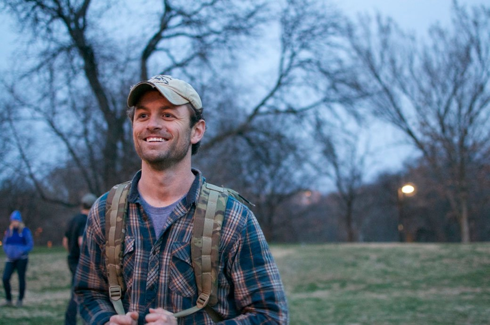
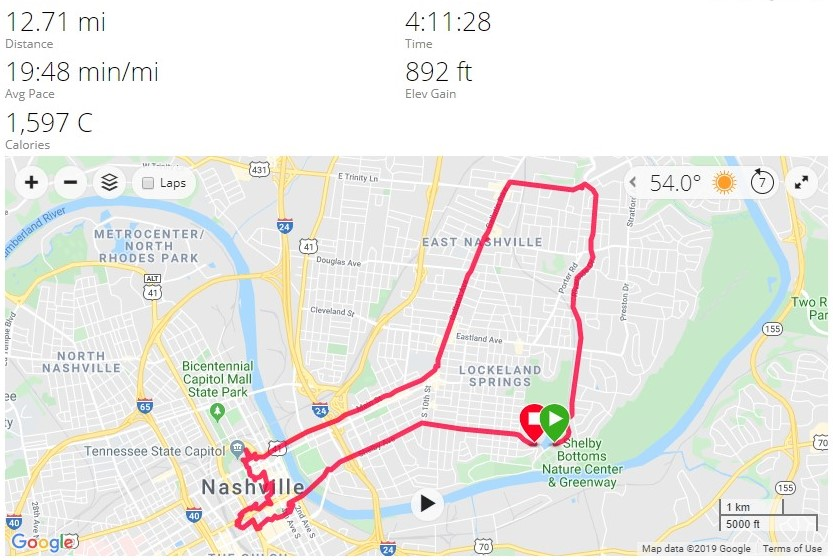

# Star Course - 12 Miler - Nashville, TN
11-02-2019

## Index
- [Star Course - 12 Miler - Nashville, TN](#star-course---12-miler---nashville-tn)
  - [Index](#index)
  - [Packing List](#packing-list)
    - [Gear](#gear)
  - [Event Location](#event-location)
  - [Cadre](#cadre)
  - [The Event](#the-event)
  - [Stats](#stats)
  - [Lessons Learned](#lessons-learned)
  - [What's Next?](#whats-next)

## Packing List
### Gear
* [SALOMON Men's Xa Pro 3D Trail Runner](https://www.amazon.com/Salomon-Trail-Running-Shoes-black/dp/B01HD6SXWA/ref=pd_rhf_ee_s_rp_c_0_8?_encoding=UTF8&pd_rd_i=B01HD6SXWA&pd_rd_r=0b5cf26b-aea4-4b56-88ec-053ae5091a77&pd_rd_w=tnevL&pd_rd_wg=vvIJG&pf_rd_p=e7de3e41-8621-46b5-8090-e75951bb9b3e&pf_rd_r=BVGQXQYTCJVR1FEYFR5H&psc=1&refRID=BVGQXQYTCJVR1FEYFR5H)
* Darn Tough Endurance 1/4 Socks
* Eddie Bauer Trek Pants
* 32 Degrees Base Layer
* GORUCK Spearhead T-Shirt
* Fila Grid Fleece
* 20L Rucker w/Sternum Strap & Hip Belt
  * [20lb Ruck Plate](https://www.goruck.com/ruck-plates-for-rucker/)
  * [3L Bladder](https://www.amazon.com/gp/product/B016SSZD3G/ref=ppx_yo_dt_b_search_asin_title?ie=UTF8&psc=1)
  * Nalgene 
  * [White Reflective Bands](https://www.amazon.com/gp/product/B000KGATL4/ref=ppx_yo_dt_b_search_asin_title?ie=UTF8&psc=1)
  * [25kN Carabiner](https://www.amazon.com/gp/product/B073XS2KLJ/ref=ppx_yo_dt_b_search_asin_title?ie=UTF8&psc=1)
  * [Pelican 1060 Micro Case](https://www.amazon.com/gp/product/B0029Q7A1K/ref=ppx_yo_dt_b_asin_title_o00_s00?ie=UTF8&psc=1)
    * Two Cliff Bars
    * NUUN Tablets
  
## Event Location
>[Mission Picnic Pavilion, Nashville, TN](https://goo.gl/maps/2W3UzQv2iugg15oA7)

## Cadre
Cadre Barbrossa

Cadre L DB

Cadre Brad

## The Event

We gathered our team, Ruck Funning, and carpooled to what we believed to be the start point. Ended up being about a 3/4 of a mile away, so we got a nice warm up before which was welcomed on a cool morning, especially in the shade. Found the large group at a shelter by the lake. 

We checked in, weighed rucks, and went over the basics. At noon each group leader received the waypoints and the 5 hour timer started. We had downloaded the [Road Warrior App](https://www.roadwarrior.app/) to plug in our waypoints to get the most efficient order to hit them in. We took a chance with the free version knowing that the 12 miler would likely fall under the 8 stop max the app had before requiring payment. We were right and only had 4 points to hit. We quickly plugged the points in and got our order before snapping a picture at the start point. We used Google Maps to navigate to points after we knew the most efficient route. At this point in time Star Courses were texting pictures to a phone number instead of using instagram.

Waypoint List

Start Point Shelby Park

Welcome to Nashville Mural

Tennessee State Capital

Ryman Auditorium

Frist Art Museum Roses

Congrats Text, Head on Back!

Showing off those patches!

## Stats

## Lessons Learned
* Nashville is NOT flat! That last leg back to endex was a hill that seemed to climb to the sun. It was honestly a solid mile of incline.
* Add the finish point to your list of points. We did not do this and our last waypoint before heading back was in the opposite direction of endex. Not by much thankfully.
  
## What's Next?
* Pearl Harbor TL in Columbus, OH!