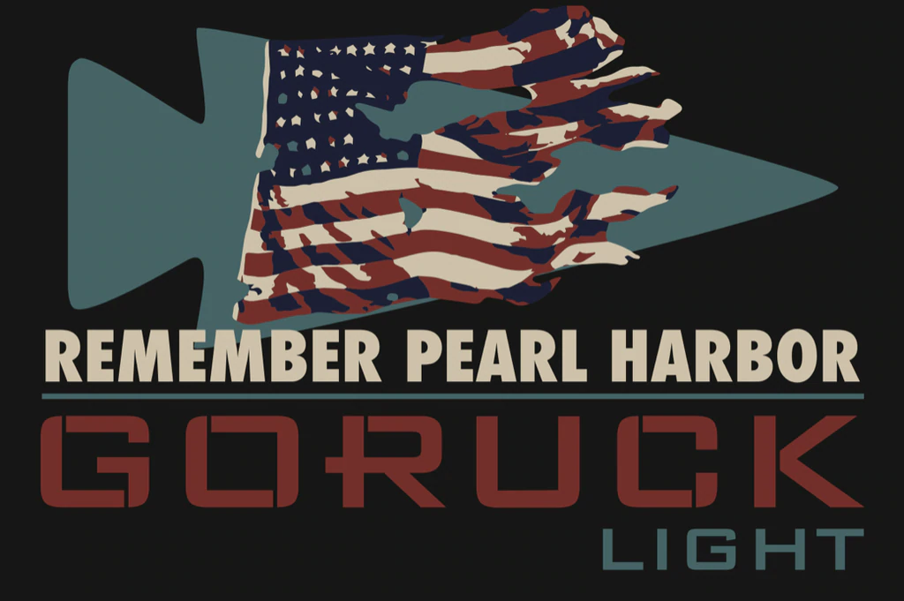
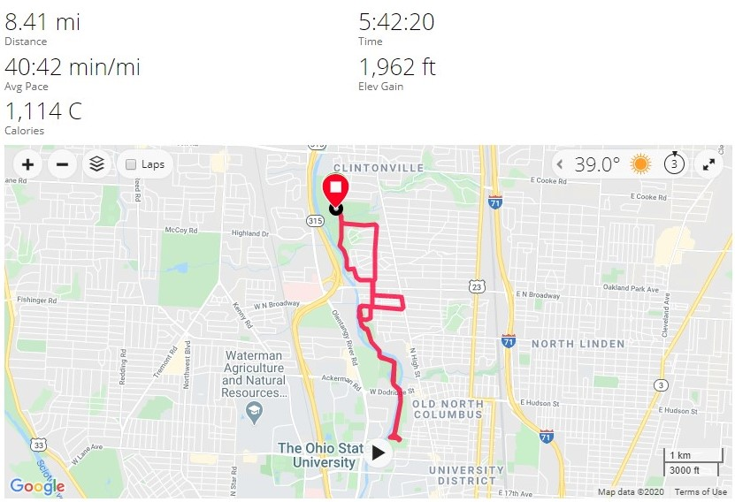

# Pearl Harbor - Light - Columbus, OH
12-07-2019

## Index
- [Pearl Harbor - Light - Columbus, OH](#pearl-harbor---light---columbus-oh)
  - [Index](#index)
  - [Event Background](#event-background)
  - [Packing List](#packing-list)
    - [Gear](#gear)
  - [Event Location](#event-location)
  - [Cadre](#cadre)
  - [The Event](#the-event)
    - [Admin](#admin)
    - [Welcoming Party](#welcoming-party)
    - [Movement](#movement)
    - [Endex](#endex)
  - [Stats](#stats)
  - [Lessons Learned](#lessons-learned)

## Event Background
The attack on Pearl Harbor was a surprise, preemptive military strike by the Imperial Japanese Navy Air Service upon the United States against the naval base at Pearl Harbor in Honolulu, Hawaii, just before 08:00, on Sunday morning, December 7, 1941. 

## Packing List
### Gear
* [SALOMON Men's Xa Pro 3D Trail Runner](https://www.amazon.com/Salomon-Trail-Running-Shoes-black/dp/B01HD6SXWA/ref=pd_rhf_ee_s_rp_c_0_8?_encoding=UTF8&pd_rd_i=B01HD6SXWA&pd_rd_r=0b5cf26b-aea4-4b56-88ec-053ae5091a77&pd_rd_w=tnevL&pd_rd_wg=vvIJG&pf_rd_p=e7de3e41-8621-46b5-8090-e75951bb9b3e&pf_rd_r=BVGQXQYTCJVR1FEYFR5H&psc=1&refRID=BVGQXQYTCJVR1FEYFR5H)
* Darn Tough Endurance Full Cushion Micro Crew
* [Prana Stretch Zion Pant](https://www.prana.com/p/stretch-zion-pant/M4ST30116-CAGR-28.html?bvstate=pg:2/ct:r&mid=paidsearch&eid=google&gid=6&nid=CPCS_Search_Brand_DSA&oid=Product_Detail_Pages&gclid=EAIaIQobChMItem1xoCs5gIVjIbACh3gagz6EAAYAiAAEgI_D_D_BwE)
* 32 Degrees Base Layer Pant
* Under Armour Coldgear Base
* GORUCK MACV SOG T- Shirt
* North Face Rain Jacket
* Fila Grid Fleece
* Under Armor Beanie
* 20L Rucker w/Sternum Strap & Hip Belt
  * [20lb Ruck Plate](https://www.goruck.com/ruck-plates-for-rucker/)
  * [3L Bladder](https://www.amazon.com/gp/product/B016SSZD3G/ref=ppx_yo_dt_b_search_asin_title?ie=UTF8&psc=1)
  * Nalgene 
  * [White Reflective Bands](https://www.amazon.com/gp/product/B000KGATL4/ref=ppx_yo_dt_b_search_asin_title?ie=UTF8&psc=1)
  * [25kN Carabiner](https://www.amazon.com/gp/product/B073XS2KLJ/ref=ppx_yo_dt_b_search_asin_title?ie=UTF8&psc=1)
  * [Pelican 1060 Micro Case](https://www.amazon.com/gp/product/B0029Q7A1K/ref=ppx_yo_dt_b_asin_title_o00_s00?ie=UTF8&psc=1)
    * Two Cliff Bars
    * NUUN Tablets
    * First Aid Kit
  * [Insulated Mechanix Gloves](https://www.amazon.com/Mechanix-Wear-FastFit-Insulated-Touchscreen/dp/B013K3KQWU/ref=pd_sbs_469_t_0/131-4361347-7502467?_encoding=UTF8&pd_rd_i=B013K3KQWU&pd_rd_r=bfde5216-fcfe-4bc7-9c33-b0c16c9d4c45&pd_rd_w=7ejA3&pd_rd_wg=wxCU4&pf_rd_p=5cfcfe89-300f-47d2-b1ad-a4e27203a02a&pf_rd_r=ZCFH20RX9G8VJZ1A9HW1&psc=1&refRID=ZCFH20RX9G8VJZ1A9HW1)
  * [Black Diamond Spot Headlamp](https://www.amazon.com/Black-Diamond-Spot-Headlamp-Size/dp/B06W54SBSL/ref=sr_1_4?dchild=1&keywords=black+diamond+headlamp+spot&qid=1578773865&sr=8-4)

## Event Location
>[Park of Roses, Columbus, OH](https://goo.gl/maps/ZgFHqkGBKgKMmua1A)

## Cadre
Cadre Brad

## The Event

### Admin
We gathered just off the parking lot and had great numbers! Lots of familiar faces, was proud to see a strong showing from the Columbus Rucking Club again along with several returning from the light!

Team weights for the night were:
* 2 x 60lb contractor sand bags
* 1 x 120lb Sandbag
* 4 x 80lb Sandbags
* 2 x 40lb Sandbags
* 3 x 6 foot logs
* American flag
* PVC team weight that I made
   

### Welcoming Party
We gathered into formation before Cadre Brad had us run to a tree about 100 yards away to place our rucks and run back and get into formation. We didn't get back quick enough so we dropped and did pushups. We got back into formation then Cadre Brad started calling out required items and we had to run and get them out of our rucks and return with them. After this we gathered in an open field and partnered up. One person one take both rucks and farmer carry them about 100 yards away and back while the other did AMRAP of some movement. We did about 5 or 6 exercises in this style.

### Movement
We headed towards the Olentangy trail and headed south near towards OSU. We also had the threat of casualty caries if we anyone went off by themselves without a buddy.

Our first stop was around 1-2 miles I believe where we talked about the events leading up to Pearl Harbor. Cadre Brad then asked us how many years it had been since the attack.  

We did a fair amount of PT compared to my previous light events, and we seemed to do quite a few Flutter Kicks!

### Endex
We made it back to the park and the sun has set just before we entered. We had a time hack to make get back to endex, and I was the TL so we did a little shuffling to make it back. We just made it with seconds to spare if I remember right!

## Stats

## Lessons Learned
* Cadre Brad loves PT!
* Don't wait 3 months to write an AAR, it's hard to remember anything! 
