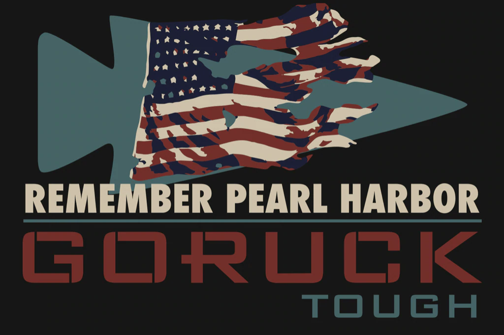
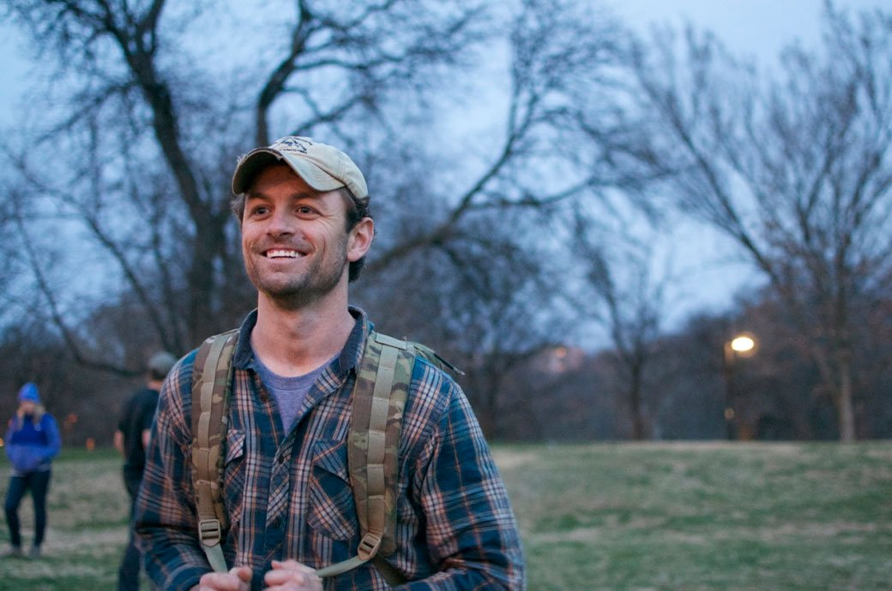
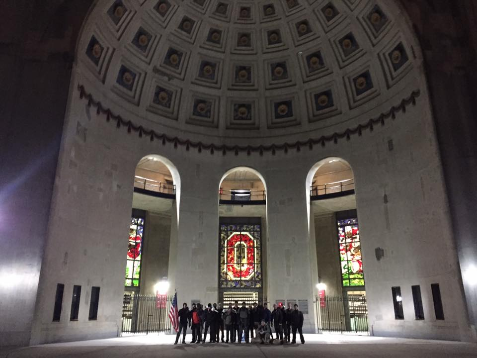

# Pearl Harbor - Tough - Columbus, OH
12-06-2019

## Index
- [Pearl Harbor - Tough - Columbus, OH](#pearl-harbor---tough---columbus-oh)
  - [Index](#index)
  - [Event Background](#event-background)
  - [Packing List](#packing-list)
    - [Gear](#gear)
  - [Event Location](#event-location)
  - [Cadre](#cadre)
  - [The Event](#the-event)
    - [Admin](#admin)
    - [Welcoming Party](#welcoming-party)
    - [Movement](#movement)
    - [Endex](#endex)
  - [Lessons Learned](#lessons-learned)
  - [What's Next?](#whats-next)

## Event Background
The attack on Pearl Harbor was a surprise, preemptive military strike by the Imperial Japanese Navy Air Service upon the United States against the naval base at Pearl Harbor in Honolulu, Hawaii, just before 08:00, on Sunday morning, December 7, 1941. 

## Packing List
### Gear
* [SALOMON Men's Xa Pro 3D Trail Runner](https://www.amazon.com/Salomon-Trail-Running-Shoes-black/dp/B01HD6SXWA/ref=pd_rhf_ee_s_rp_c_0_8?_encoding=UTF8&pd_rd_i=B01HD6SXWA&pd_rd_r=0b5cf26b-aea4-4b56-88ec-053ae5091a77&pd_rd_w=tnevL&pd_rd_wg=vvIJG&pf_rd_p=e7de3e41-8621-46b5-8090-e75951bb9b3e&pf_rd_r=BVGQXQYTCJVR1FEYFR5H&psc=1&refRID=BVGQXQYTCJVR1FEYFR5H)
* Darn Tough Endurance Full Cushion Micro Crew
* [Prana Stretch Zion Pant](https://www.prana.com/p/stretch-zion-pant/M4ST30116-CAGR-28.html?bvstate=pg:2/ct:r&mid=paidsearch&eid=google&gid=6&nid=CPCS_Search_Brand_DSA&oid=Product_Detail_Pages&gclid=EAIaIQobChMItem1xoCs5gIVjIbACh3gagz6EAAYAiAAEgI_D_D_BwE)
* 32 Degrees Base Layer Pant
* Under Armour Coldgear Base
* GORUCK MACV SOG T- Shirt
* North Face Rain Jacket
* Fila Grid Fleece
* Under Armor Beanie
* 20L Rucker w/Sternum Strap & Hip Belt
  * [30lb Ruck Plate](https://www.goruck.com/ruck-plates-for-rucker/)
  * [3L Bladder](https://www.amazon.com/gp/product/B016SSZD3G/ref=ppx_yo_dt_b_search_asin_title?ie=UTF8&psc=1)
  * Nalgene 
  * [White Reflective Bands](https://www.amazon.com/gp/product/B000KGATL4/ref=ppx_yo_dt_b_search_asin_title?ie=UTF8&psc=1)
  * [25kN Carabiner](https://www.amazon.com/gp/product/B073XS2KLJ/ref=ppx_yo_dt_b_search_asin_title?ie=UTF8&psc=1)
  * [Pelican 1060 Micro Case](https://www.amazon.com/gp/product/B0029Q7A1K/ref=ppx_yo_dt_b_asin_title_o00_s00?ie=UTF8&psc=1)
    * Three Cliff Bars
    * NUUN Tablets
    * First Aid Kit
  * [Insulated Mechanix Gloves](https://www.amazon.com/Mechanix-Wear-FastFit-Insulated-Touchscreen/dp/B013K3KQWU/ref=pd_sbs_469_t_0/131-4361347-7502467?_encoding=UTF8&pd_rd_i=B013K3KQWU&pd_rd_r=bfde5216-fcfe-4bc7-9c33-b0c16c9d4c45&pd_rd_w=7ejA3&pd_rd_wg=wxCU4&pf_rd_p=5cfcfe89-300f-47d2-b1ad-a4e27203a02a&pf_rd_r=ZCFH20RX9G8VJZ1A9HW1&psc=1&refRID=ZCFH20RX9G8VJZ1A9HW1)
  * [Black Diamond Spot Headlamp](https://www.amazon.com/Black-Diamond-Spot-Headlamp-Size/dp/B06W54SBSL/ref=sr_1_4?dchild=1&keywords=black+diamond+headlamp+spot&qid=1578773865&sr=8-4)

## Event Location
>[Park of Roses, Columbus, OH](https://goo.gl/maps/ZgFHqkGBKgKMmua1A)

## Cadre
Cadre Brad

## The Event

### Admin
We gathered just off the parking lot and had surprisingly great numbers! It was expected to get in the low 20s so I expected to have a fair amount of no shows. We found out we only had 4 no shows leaving 20 participants! Lots of familiar faces, was proud to see a strong showing from the Columbus Rucking Club with 15 members!

Team weights for the night were:
* 2 x 60lb contractor sand bags
* 2 x 5 gallon water cooler jugs
* American flag
* PVC team weight that I made
   

### Welcoming Party
During this time Cadre Brad gave us some tips to handle the cold weather. Said that we should be,"comfortably cold" and that we shed layers during exercises. He told us of his time on mountain teams and that sweating through your layers and then stopping means you freeze! So go light during movement and layers up when you stop. We all noted and shed a couple layers during the welcoming party.
* pushups
* shoulder rotations (side, above head, front)
* jumping jacks
* bear crawl
* crab walk
* ruck squats
* jumping jacks

### Movement
We headed towards the Olentangy trail where Cadre Brad mentioned we would be most of the night. We picked up three, six-foot logs during this first movement to add to our team weights. We also had the threat of casualty caries if we anyone went off by themselves without a buddy.

Our first stop was around 1-2 miles I believe where we talked about the events leading up to Pearl Harbor. Cadre Brad then asked us how many years it had been since the attack. This being in 2019 it was 78 years. In remembrance Cadre Brad had us do 78 8 count bodybuilders! We chunked them into sets of 15 then 17 for the last and got it done. Feeling good at this point thinking we are past the worst of the PT. 

Our next movement is longer this time and we end up at [Fred Beekman Park](https://goo.gl/maps/ZC2nHRCykTvZ9iPn7). We missed our time hack and had to do another 28 8 count bodybuilders! Getting fun now! We are now in the middle of 4 baseball fields and you can just tell Cadre Brad has something in mind. We gather around Cadre Brad as he tells us about Cadre Roony and his connection with him. He truly sounds like an awesome man, I wish I had gotten the opportunity to do an event with him and meet him. He has had a huge impact on the GORUCK community, which made what came next exciting for me. Cadre Brad said we were going to do the [Cadre Roony WOD](https://alldayruckoff.com/training/workouts/goruck-cadre-roony-wod/) in the middle of this park in the middle of the night in this freezing weather, knowing he'd be looking down on us getting a kick out of it. The Cadre Roony WOD was as follows:
* Long run (around the baseball field)
* 5 rounds of
  * 75 4ct flutter kicks
  * 75 4ct mountain climbers
  * Short run (to fence and back)
  * 75 overhead arm claps
  * 75 ruck squats
  * short run (to fence and back)
* Long Run (around the baseball field)

We then began the journey back to start minus one as they dropped after the WOD, making a quick stop to snag this sweet picture:

This is a good place to note that Cadre Brad was attending LSU, wearing a LSU Beanie and would gag anytime we chanted OH - IO. I think to take this picture hurt a little :) .

We made a couple stops to discuss the events of Pearl Harbor again, one in the Oval and one at a park off of the trail. These stops were where we felt every bit of the 20 something degrees that were left. It was COLD and lack of movement made it worse. I added an extra layer from my Ruck during the stop at the Oval and kept it on until endex.

### Endex
We made it back to the park and the sun had risen just before we entered. I was surprised to see we kept all the weight, minus any water we drank. We didn't go back to where we formed up originally so I figured we had some work left. I was kind of right, but it wasn't some work, it was a lot of work! We discussed the lives lost on the Arizona, the ship with heaviest lose of life at 1,177. Then the total amount that perished during the attack of 2,335 in total. We then did a workout to make sure we remembered those numbers!
* 2 rounds of
  * 11 8ct bodybuilder
  * 77 4ct flutter kicks
  * short ruck
  * 23 overhead ruck press
  * 35 ruck squats
* 2 rounds of
  * 12 8ct bodybuilders
  * 7 ruck thrusters

The last 2 rounds were 12 then 7 which represented the obvious date of the Pearl Harbor attack, but it had another meaning for Care Brad. On that day he lost a close team member who left a family behind, including a newborn child he never got the chance to meet. Cadre Brad spoke about meeting his buddies child and keeping in touch with his family when he got back from his deployment. A real gut check moment about our service men and women and their sacrifices. Incredibly grateful for them. A spark of motivation to finish the event strongly for sure.

## Lessons Learned

* Cold events are another beast!
  * Layers are important, shed them during exercise and put them back on when stopped.
* Cadre Brad loves PT!
* Cadre Roony WOD is a hell of a workout!

  
## What's Next?

* Pearl Harbor Light in a few hours!
