# A Shau Valley - Light - Cincinnati, OH
03-14-2020

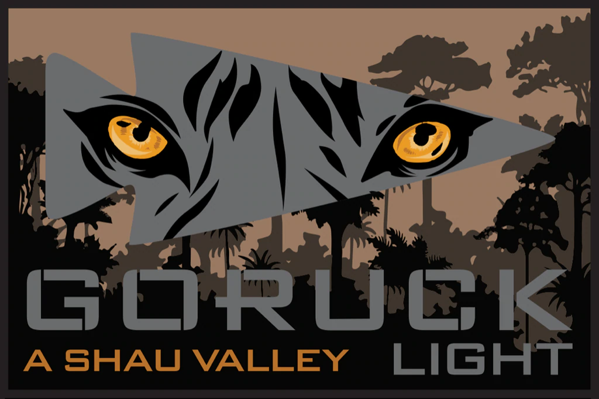
## Index
- [A Shau Valley - Light - Cincinnati, OH](#a-shau-valley---light---cincinnati-oh)
  - [Index](#index)
  - [Event Background](#event-background)
  - [Packing List](#packing-list)
    - [Gear](#gear)
  - [Event Location](#event-location)
  - [Cadre](#cadre)
  - [The Event](#the-event)
    - [Between Events](#between-events)
    - [Admin](#admin)
    - [Welcoming Party](#welcoming-party)
    - [Movement](#movement)
    - [Endex](#endex)
  - [Stats](#stats)
  - [Lessons Learned](#lessons-learned)
  - [What's Next?](#whats-next)

## Event Background
"Looking back on the battle, Adkins said it was the toughest he can recall. "It was just not my time to die," despite being "blown from mortar pits on several occasions." Asked how he could keep going with 18 wounds, he replied "You just do. Quitting isn't an option. That's what you train for. In the jungle environment, we became better than some of the North Vietnamese soldiers”
— SGM Bennie G. Adkins, 5th SFG

The Battle for the A Shau Valley was located 2km east of the Laos border and directly adjacent to the PAVN’s (People’s Army of Vietnam) most strategic logistics route to the Ho Chi Minh Trail which supplied men, weapons, and equipment from Communist-led North Vietnam to their supporters fighting in South Vietnam. The battle lasted three long arduous days in March of 1966 involving 17 Green Beret’s from the 5th Special Forces Group (5th SFG) and some 400 South Vietnamese soldiers defending a Special Forces A-Camp against over 2000 enemy soldiers. The fighting which included major assaults, mortar barrages, and hand to hand combat resulted in the Camp being overrun and the death of five 5th Special Forces Group (5th SFG) soldiers, three aircrew from an AC-47D “Spooky 70” Gun Ship, 288 South Vietnamese soldiers, and an estimated 800 enemies. The aftermath included 2 Medal of Honor awardees for their selfless acts of heroism. One for Major Bernard F. Fisher after he landed his A-1 aircraft on the airstrip rescuing MAJ D.W. Myers after he was shot down in his aircraft and another for Green Beret SGM Bennie G. Adkins for distinguishing himself by personally killing an estimated 175 enemy combatants all while being wounded 18 times during 38 hours of close-combat fighting. Even though the SF A-Camp was attacked and overrun by superior numerical forces the 17 Green Berets and 400 South Vietnamese soldiers fought to the last possible moment defending the key terrain that they knew could affect the outcome of the war. Let’s commemorate the ultimate sacrifice of the 5 Green Berets, 3 Air Crew and their 288 South Vietnamese Brethren.

## Packing List
### Gear
* [Saucony Iso Ride 2](https://www.saucony.com/en/ride-iso-2/39110M.html#)
* [Darn Tough Hiker Merino Wool Micro Crew](https://www.amazon.com/gp/product/B000XFW6OU/ref=ppx_yo_dt_b_search_asin_title?ie=UTF8&psc=1)
* Columbia OmniDry Pants
* Under Armour Cold Gear
* Columbus Rucking Club T-Shirt
* North Face Rain Jacket
* American Flag Beanie
* 20L Rucker w/Sternum Strap & Hip Belt
  * [20lb Ruck Plate](https://www.goruck.com/ruck-plates-for-rucker/)
  * [3L Bladder](https://www.amazon.com/gp/product/B016SSZD3G/ref=ppx_yo_dt_b_search_asin_title?ie=UTF8&psc=1)
  * GORUCK Nalgene 
  * [White Reflective Bands](https://www.amazon.com/gp/product/B000KGATL4/ref=ppx_yo_dt_b_search_asin_title?ie=UTF8&psc=1)
  * [25kN Carabiner](https://www.amazon.com/gp/product/B073XS2KLJ/ref=ppx_yo_dt_b_search_asin_title?ie=UTF8&psc=1)
  * [Pelican 1060 Micro Case](https://www.amazon.com/gp/product/B0029Q7A1K/ref=ppx_yo_dt_b_asin_title_o00_s00?ie=UTF8&psc=1)
    * First Aid Kit
    * Quiter Cash
    * ID
    * Spare Batteries
    * Spare Socks
    * Chapstick
    * Phone
    * Garmin Watch
  * Ziploc Baggie
    * NUUN Tablets
    * Two Cliff Bars
    * One pack of Cliff Bloks
  * [Original Mechanix Gloves](https://www.amazon.com/dp/B0001VNZUA/ref=twister_B07ZWL2TGQ?_encoding=UTF8&psc=1)
  * [Black Diamond Spot Headlamp](https://www.amazon.com/Black-Diamond-Spot-Headlamp-Size/dp/B06W54SBSL/ref=sr_1_4?dchild=1&keywords=black+diamond+headlamp+spot&qid=1578773865&sr=8-4)

## Event Location
>[Eden Park Basketball Courts, Cincinnati, OH](https://goo.gl/maps/TdEkGsqDtbiHBf1S8)

## Cadre
Cadre Steve
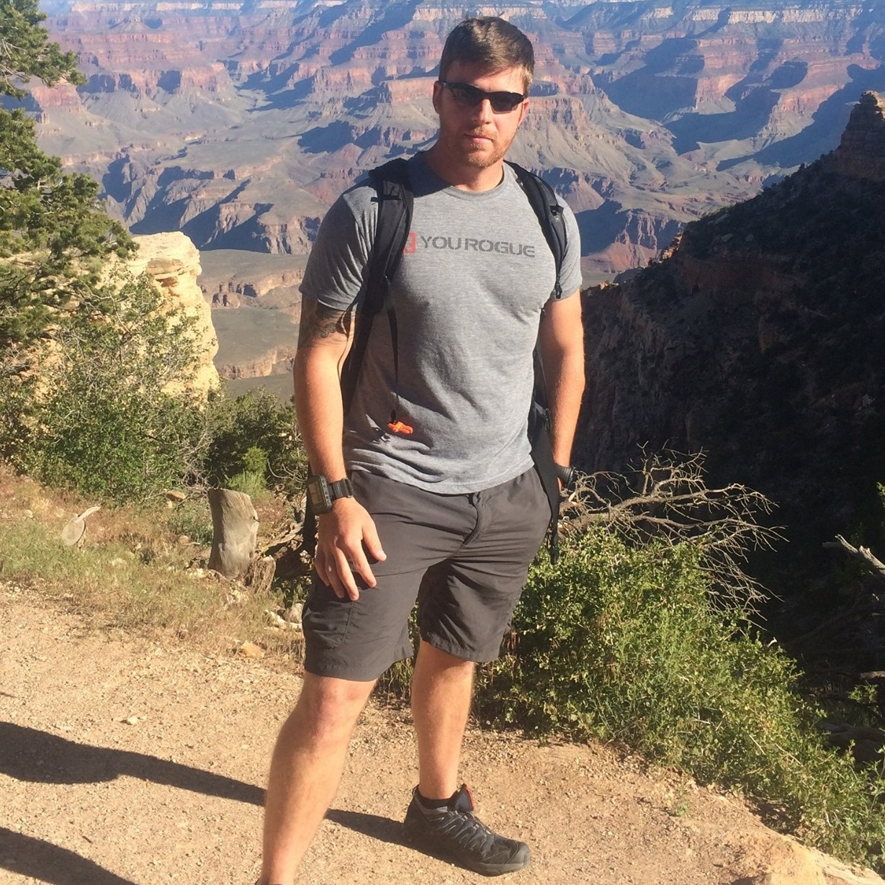

## The Event

### Between Events

I was very questionable to come back out to the light. I felt terrible after the tough. Stomach was bugging me, and I was incredibly sore. My game plan was to do what I could and make the call 1 hour before start. I grabbed a waffle, some chocolate milk, lots of water, and a danish at my hotel. Grabbed a quick shower, and I laid down to get some sleep. Best case was 2 hours 45 minutes of sleep, I probably got 2 hours 44 minutes! I woke up and cautiously swung out of bed and surprisingly felt good. So I grabbed my pre-packed ziploc of Cliff Bars, Cliff Bloks, and Nuun Tablets threw it in my Ruck, swapped to a 20 lb plate and hailed an uber to get to the start point, ready to do this thing!

### Admin
We gathered just off the parking lot on a basketball court. Our team weights made another appearance!
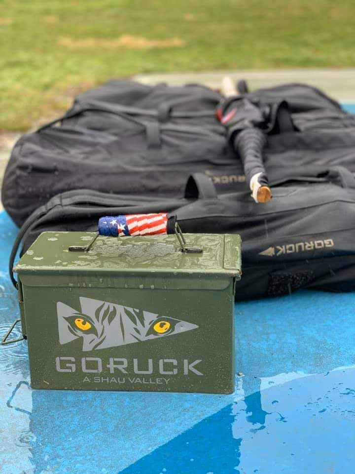
 
 First task was to get into formation in reverse alphabetic order for all 26 people. We executed and Cadre Steve read through roster and checked that required items were in our ruck. 

 Things were familiar from the tough, temperature was similar to what the tough ended at; high 30s. However it was a steady rain/sleet mix and it was not going anywhere. This was going to be a cold and wet light!
 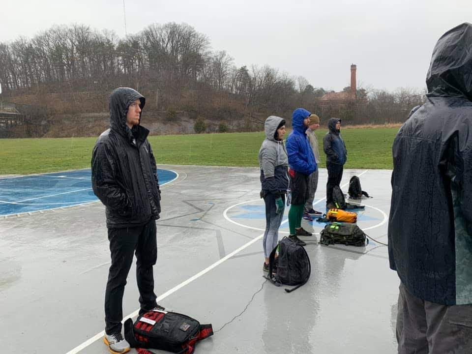
 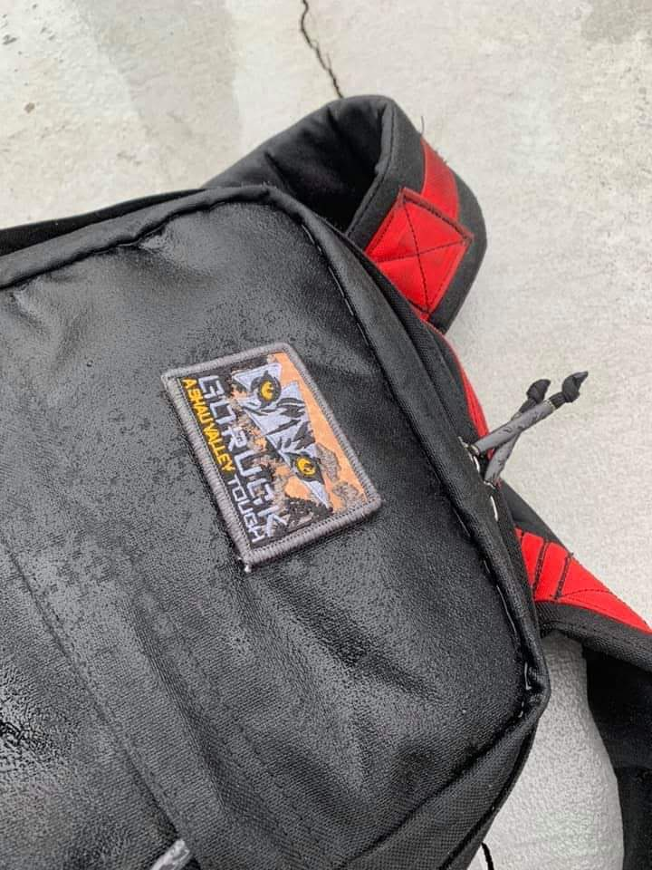

### Welcoming Party
We split into two teams of 13 and lined up for relay races! We had to bear crawl about 40 yards to Cadre Steve, then crab walk back to tag the next person in line. This thoroughly got everyone soaked right off the bat!
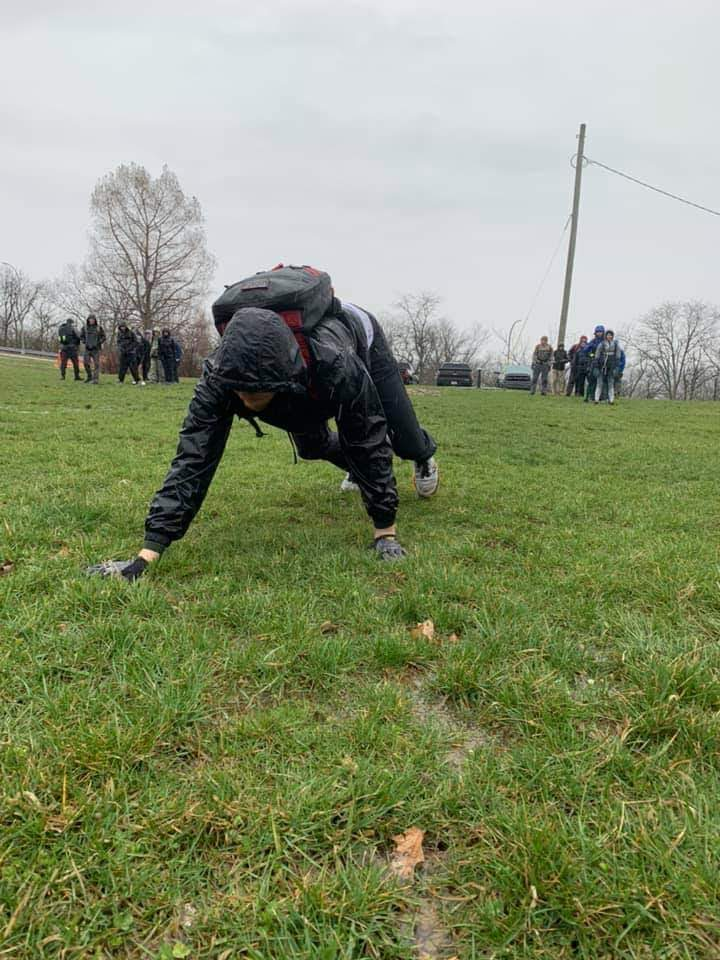
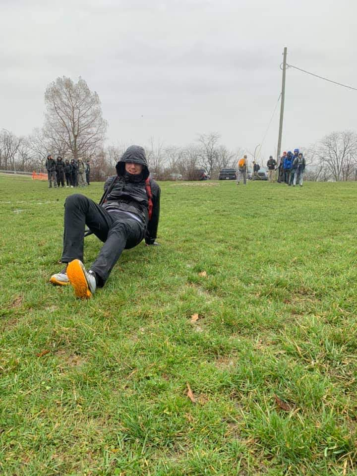

We then spread out in our lines and shared the team punishment of about 20 burpees jumping over our rucks between each.

### Movement
We headed down near the river to a park where we found a few extra coupons in addition to our existing:
* 4 x 120lb Sandbags
* 2 x 80lb Sandbags
* American Flag
* GORUCK Flag
* 25lb Team Weight 

We found:
* 3 x 20lb rocks
* 1 Log

Our next movement was across the river into Newport, KY about 2 or 3 miles. We formed up and headed out about 200 yards before we were told to put everything down, lay on our backs, get our rucks overhead, and feet 6 inches off the ground. While waiting for everyone to do so, Cadre Steve reminded us that he needed 3 things from us before every movement:
* Headcount
* Route we were taking
* Estimated time to complete movement

We failed to do so, so we did flutter kicks for a while to make sure we didn't forget again!
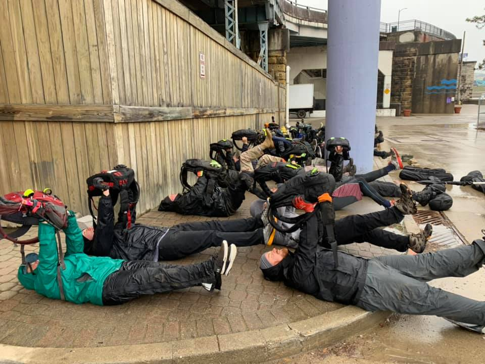

We formed again, informed Cadre Steve we had 26 people, were going 2.7 miles (I think), and were going to do so in 1 hour. The we headed out across the bridge into Kentucky.
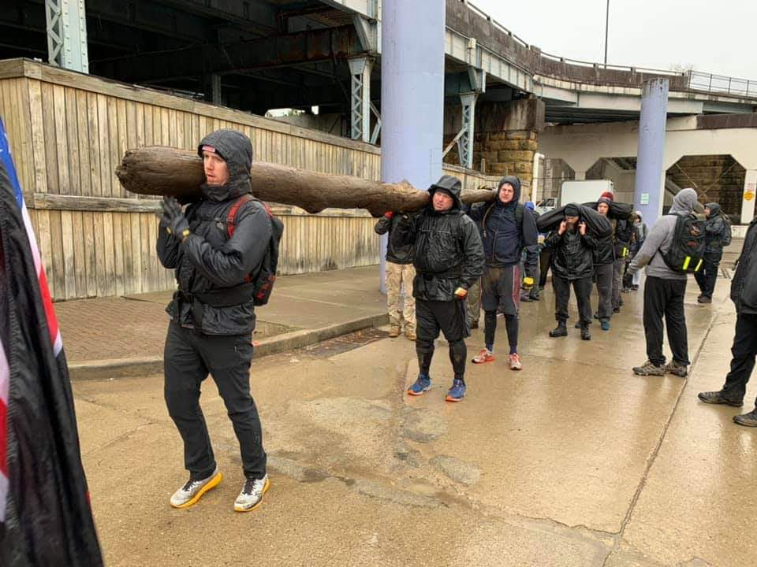

We ended movement under an overpass out of the rain and discussed Dynamic Leadership: the ability to figure out what motivates those you are responsible for, whether to use a strong voice or sharing expectations calmly along with how they are measuring against them. We then discussed the events of A Shau Valley. During this time people were wet and cold, the lack of movement made several start to significantly shiver. When we were finally ready to move, we formed pretty quickly.

We headed back across the river into Cincinnati to a parking garage stairwell. Here we were tasked with getting all of our coupons, minus the log up 5 levels of the stairwell. Oh yeah we could only bear crawl or crab walk up the stairs. If you stand up, you start over. We actually made it up in about 15 minutes, but since we put the rocks into rucks, which was apparently against the rules we had to go back down and in 10 minutes this time. We had the movement down and made this pretty easily.

We took a pause in the garage to get a quick demo of Ruck Wrap. I had already grabbed some a little while back, but it was great to get a demo and explanation of things. Wrap at 50% tight, for 3-5 minutes, while doing mobility exercises for what you just wrapped.

The last movement was to swing by where we picked up our log and rocks to return them, before heading back to endex. Unfortunately we had to keep our sandbags.

### Endex
We headed back up to Eden Park with our sandbags, flags, and team weight. Once again I wanted to finish strong so I grabbed a 120lb sandbag to carry up the last hill to endex and finish strong.
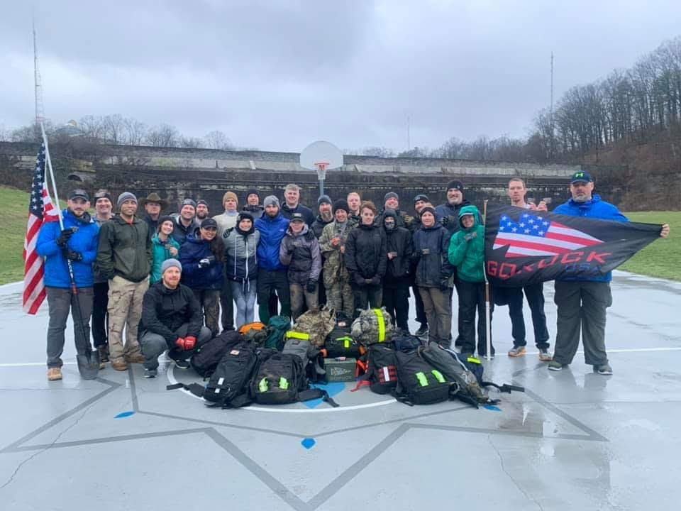

The T/L Finishers from the weekend:
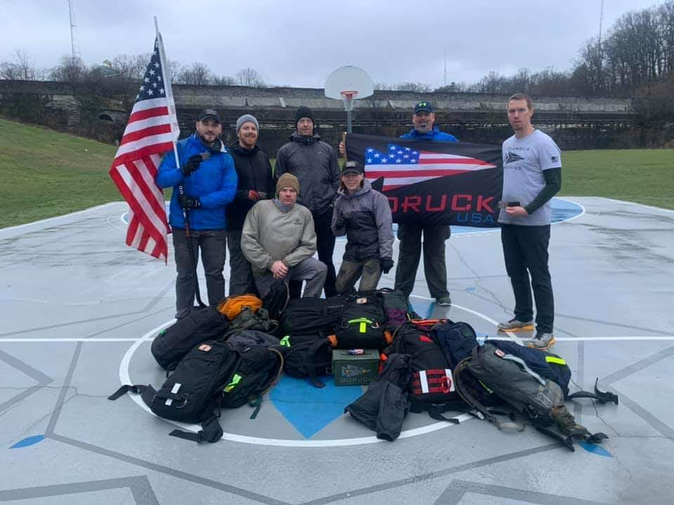

## Stats
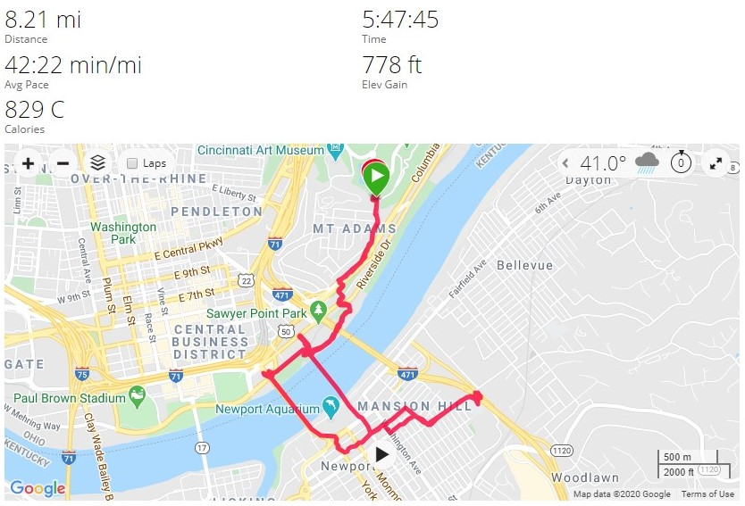

## Lessons Learned

* Cadre Steve still runs his events heavy! Didn't change from the tough!
* Cincinnati has unforgiving hills! Less than the tough, but they were still there!
* Feet STILL feel great! Trail shoes are definitely a distant memory now.
* Spend the hours between events wisely, it can make a world of difference.

  
## What's Next?

* Columbus Star Course 26.2 with the wife! Hopefully this happens with all of the concerns of COVID-19. Everything is quickly grinding to halt, I was surprised these events still happened on this weekend.
