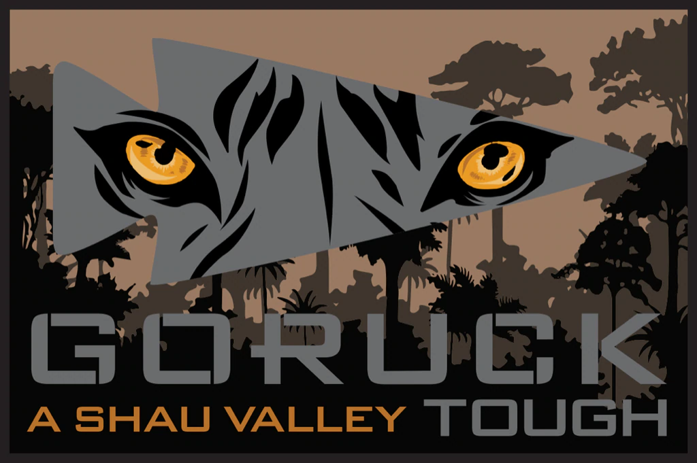
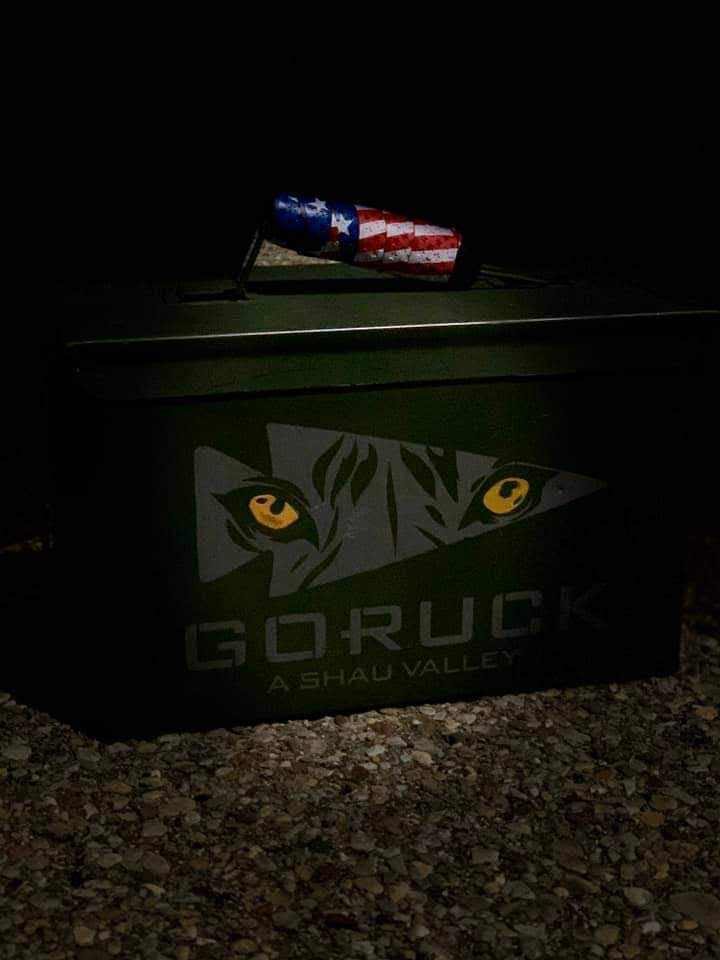
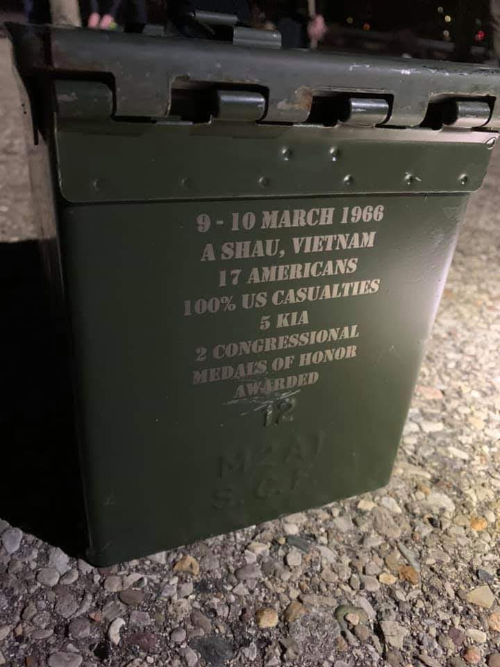
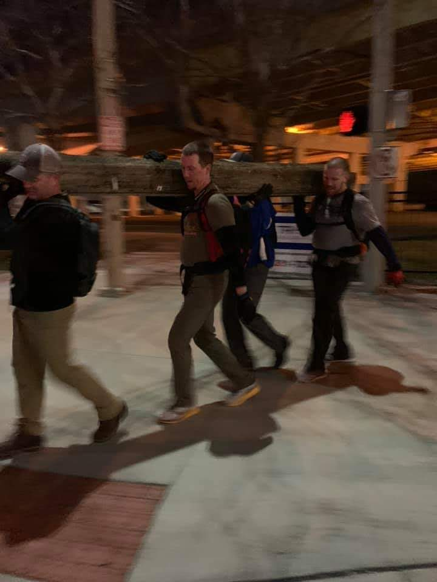
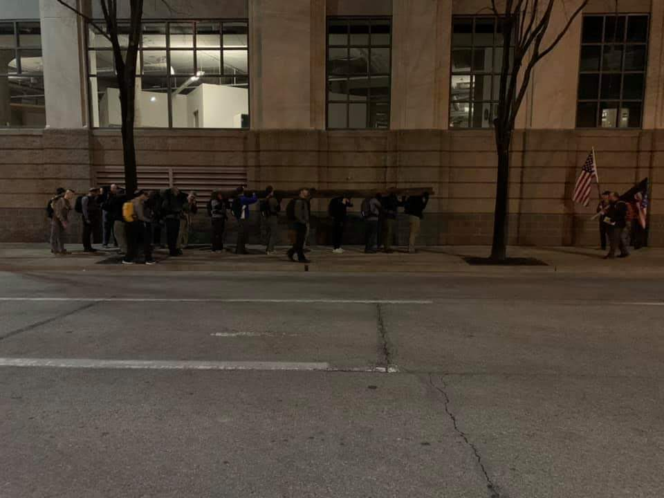
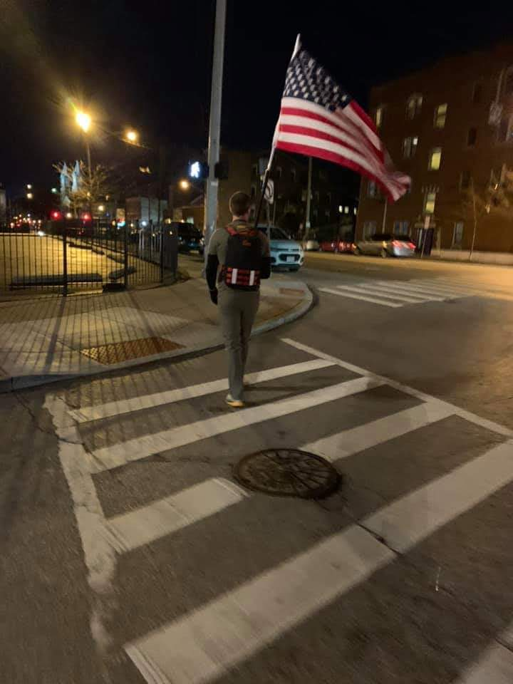
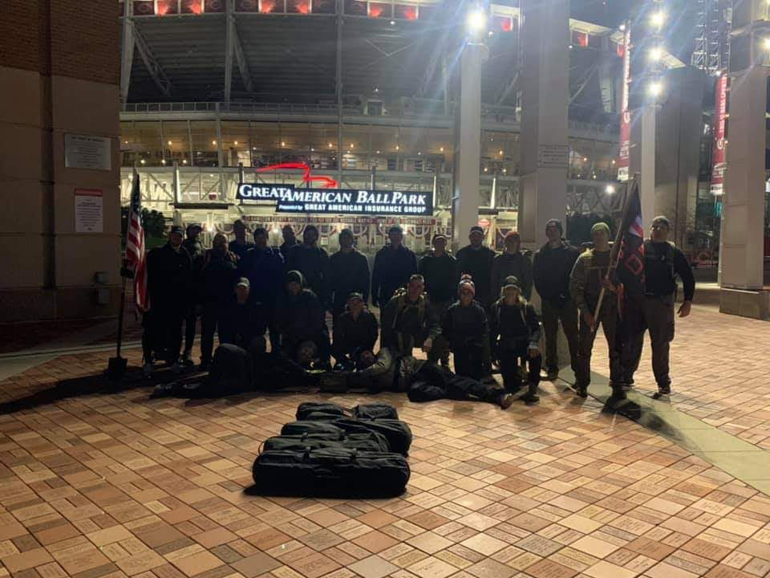
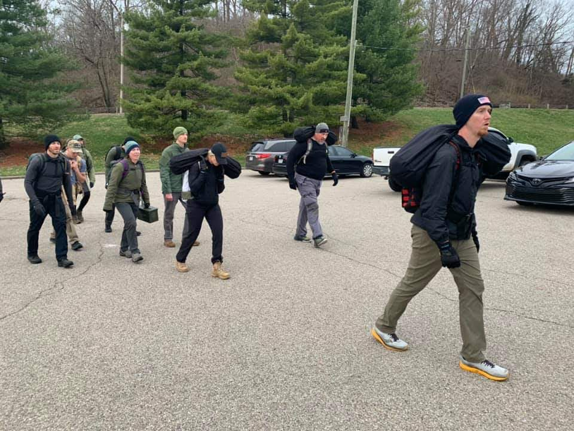
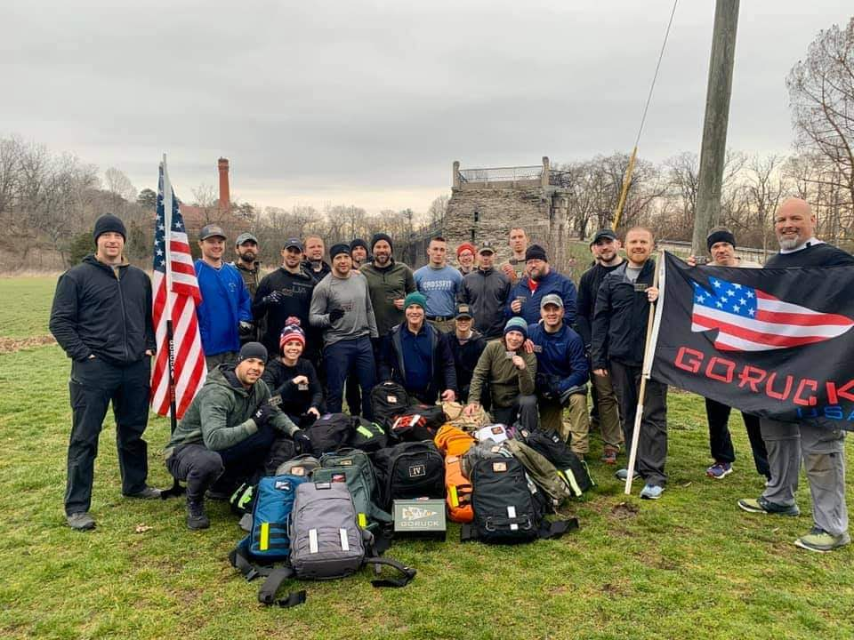
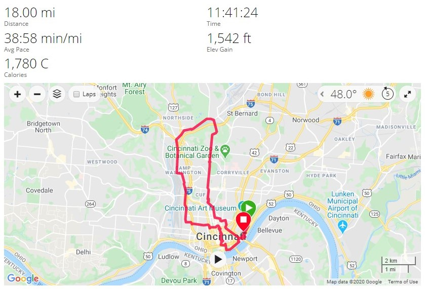

# A Shau Valley - Tough - Cincinnati, OH
03-13-2020

## Index
- [A Shau Valley - Tough - Cincinnati, OH](#a-shau-valley---tough---cincinnati-oh)
  - [Index](#index)
  - [Event Background](#event-background)
  - [Packing List](#packing-list)
    - [Gear](#gear)
  - [Event Location](#event-location)
  - [Cadre](#cadre)
  - [The Event](#the-event)
    - [Admin](#admin)
    - [Welcoming Party](#welcoming-party)
    - [Movement](#movement)
    - [Endex](#endex)
  - [Stats](#stats)
  - [Lessons Learned](#lessons-learned)
  - [What's Next?](#whats-next)

## Event Background
"Looking back on the battle, Adkins said it was the toughest he can recall. "It was just not my time to die," despite being "blown from mortar pits on several occasions." Asked how he could keep going with 18 wounds, he replied "You just do. Quitting isn't an option. That's what you train for. In the jungle environment, we became better than some of the North Vietnamese soldiers”
— SGM Bennie G. Adkins, 5th SFG

The Battle for the A Shau Valley was located 2km east of the Laos border and directly adjacent to the PAVN’s (People’s Army of Vietnam) most strategic logistics route to the Ho Chi Minh Trail which supplied men, weapons, and equipment from Communist-led North Vietnam to their supporters fighting in South Vietnam. The battle lasted three long arduous days in March of 1966 involving 17 Green Beret’s from the 5th Special Forces Group (5th SFG) and some 400 South Vietnamese soldiers defending a Special Forces A-Camp against over 2000 enemy soldiers. The fighting which included major assaults, mortar barrages, and hand to hand combat resulted in the Camp being overrun and the death of five 5th Special Forces Group (5th SFG) soldiers, three aircrew from an AC-47D “Spooky 70” Gun Ship, 288 South Vietnamese soldiers, and an estimated 800 enemies. The aftermath included 2 Medal of Honor awardees for their selfless acts of heroism. One for Major Bernard F. Fisher after he landed his A-1 aircraft on the airstrip rescuing MAJ D.W. Myers after he was shot down in his aircraft and another for Green Beret SGM Bennie G. Adkins for distinguishing himself by personally killing an estimated 175 enemy combatants all while being wounded 18 times during 38 hours of close-combat fighting. Even though the SF A-Camp was attacked and overrun by superior numerical forces the 17 Green Berets and 400 South Vietnamese soldiers fought to the last possible moment defending the key terrain that they knew could affect the outcome of the war. Let’s commemorate the ultimate sacrifice of the 5 Green Berets, 3 Air Crew and their 288 South Vietnamese Brethren.

## Packing List
### Gear
* [Saucony Iso Ride 2](https://www.saucony.com/en/ride-iso-2/39110M.html#)
* [Darn Tough Light Hiker Micro Crew Light Cushion ](https://darntough.com/products/fw19-mens-light-hiker-micro-crew-light-cushion?variant=28842606428213)
* Eddie Bauer Men’s Trek Pant
* 32 Degrees Base Shirt
* GORUCK MACV SOG T-Shirt
* North Face Rain Jacket
* American Flag Beanie
* 20L Rucker w/Sternum Strap & Hip Belt
  * [30lb Ruck Plate](https://www.goruck.com/ruck-plates-for-rucker/)
  * [3L Bladder](https://www.amazon.com/gp/product/B016SSZD3G/ref=ppx_yo_dt_b_search_asin_title?ie=UTF8&psc=1)
  * GORUCK Nalgene 
  * [White Reflective Bands](https://www.amazon.com/gp/product/B000KGATL4/ref=ppx_yo_dt_b_search_asin_title?ie=UTF8&psc=1)
  * [25kN Carabiner](https://www.amazon.com/gp/product/B073XS2KLJ/ref=ppx_yo_dt_b_search_asin_title?ie=UTF8&psc=1)
  * [Pelican 1060 Micro Case](https://www.amazon.com/gp/product/B0029Q7A1K/ref=ppx_yo_dt_b_asin_title_o00_s00?ie=UTF8&psc=1)
    * First Aid Kit
    * Quiter Cash
    * ID
    * Spare Batteries
    * Spare Socks
    * Chapstick
    * Phone
    * Garmin Watch
  * Ziploc Baggie
    * NUUN Tablets
    * Two Cliff Bars
    * One pack of Cliff Bloks + Caffeine
  * [Insulated Mechanix Gloves](https://www.amazon.com/Mechanix-Wear-FastFit-Insulated-Touchscreen/dp/B013K3KQWU/ref=pd_sbs_469_t_0/131-4361347-7502467?_encoding=UTF8&pd_rd_i=B013K3KQWU&pd_rd_r=bfde5216-fcfe-4bc7-9c33-b0c16c9d4c45&pd_rd_w=7ejA3&pd_rd_wg=wxCU4&pf_rd_p=5cfcfe89-300f-47d2-b1ad-a4e27203a02a&pf_rd_r=ZCFH20RX9G8VJZ1A9HW1&psc=1&refRID=ZCFH20RX9G8VJZ1A9HW1)
  * [Black Diamond Spot Headlamp](https://www.amazon.com/Black-Diamond-Spot-Headlamp-Size/dp/B06W54SBSL/ref=sr_1_4?dchild=1&keywords=black+diamond+headlamp+spot&qid=1578773865&sr=8-4)

## Event Location
>[Eden Park Basketball Courts, Cincinnati, OH](https://goo.gl/maps/TdEkGsqDtbiHBf1S8)

## Cadre
Cadre Steve

## The Event

### Admin
We gathered just off the parking lot on a basketball court. I got to check out the team weight, which is by far the coolest team weight I have had so far!

 
 First task was to get into formation in alphabetic order. We executed and Cadre Steve read through roster and checked that required items were in our ruck.

### Welcoming Party
We spread out on the perimeter of the basketball court and executed the following exercises:

10 rounds:
* 10 x Ruck Thrusters
* 10 x Ruck Swings
* 10 x Lunges (5 ea. Leg)

### Movement
We headed down near the river to a sand volleyball court to fill up the coupons for the evening. We filled:
* 4 x 120lb Sandbags
* 2 x 80lb Sandbags

Other items already being carried:
* American Flag
* GORUCK Flag
* 25lb Team Weight 

The next movement was a short movement to a clearing in a woods where off in the distance I could just make out our enemy of the night. A telecommunication device that was about 25 foot long and was 300lbs+ easily. We then discussed the next movement, Cadre Steve wanted three things before every movement:
* Headcount
* Route we were taking
* Estimated time to complete movement

Our TL gave headcount of 23, route of 2.7 miles, and a time of 80 minutes. Cadre Steve said sure (in hindsight maybe a little too quickly). Then we were off to downtown Cincinnati. At one point I swear we carried this telephone pole up hill for 2 miles! It was absolutely crushing us, and our answer was to put more people under it. What started out as 6, ended up at 9 people under it taking baby steps to walk. We struggled with its size and how to get people under it to evenly distribute the weight. We did good coming out of a break, having all people of a similar height start with it. However that fell apart as soon as people started switching in. Me being taller, I really struggled without taller folks on it with me because I had to hunch over or squat walk/waddle to get under it, which is not pleasant.

Needless to say we got a lot of interesting looks carrying this downtown in front of all of the bars near closing time! We were recorded many times during this! Not sure why people were so surprised, guess they have a different idea of what a fun Friday night is.

We finally made it to our destination, WELL over our 80 minute estimate. Cadre Steve informed us we took 5 hours! The kicker being it was actually 5 miles, not 2.7 we were thinking. Either way an hour per mile is unacceptable so we needed to pay for that. We ended up doing 75 x 8 count body builders. Cadre Steve broadcasted that on Facebook live to the amusement of many I hear. Mercifully we got to stash the telephone pole at this point and proceed on. We snaked our way around Cincinnati eventually finding ourselves in front of the Great American Ballpark

At one point during the night we had a couple guys wanting to quit. We had some folks spot this quickly and to the tune of, "No @#$%^&* Way!" we told them we were getting through this together as a team. We assessed their needs, and made sure they weren't under weight as much as possible. We even carried one of their rucks for the last couple miles. We made sure everyone finished that night.

### Endex
We headed back up to Eden Park with our sandbags, flags, and team weight. At this point switches are happening frequently and people are feeling it, especially myself. I am wondering what the hell I was thinking signing up the light in a few hours, because at this point its very unlikely. Once the sun rises, spirits lift and you can see people pushing themselves to carry longer. I made it a priority to find a 120lb sandbag to carry up the last hill to endex and finish it right.

## Stats

## Lessons Learned

* Cadre Steve runs his events heavy!
* Cincinnati has unforgiving hills!
* Sometimes less is more, especially with telephone polls or logs. We started with 6 people, but put unnecessary strain on ourselves trying to carry with more people and short stepping. We probably should have designated partners of similar heights that would switch in when their partner needed a break.
* Feet feel great! Running shoes for the win! Trail shoes may be a distant memory now.

  
## What's Next?

* A Shau Valley Light in a few hours? Game plan at this point is to replenish, rest, recover, and reassess 1 hour prior to start of light for go/no-go.
