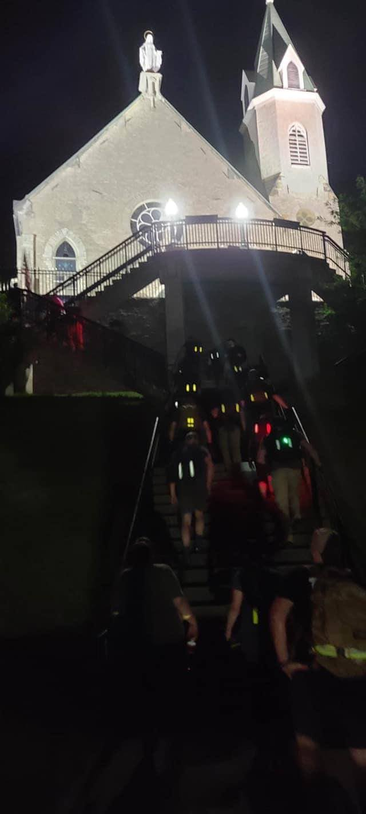
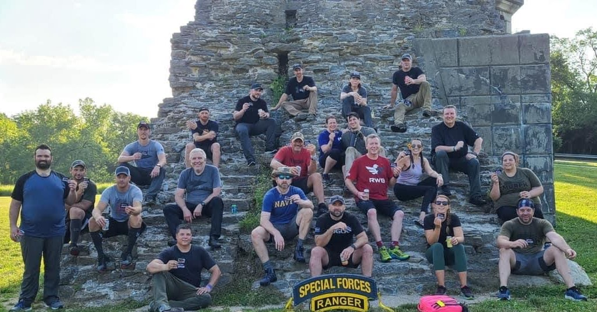

# Red Wings - Tough - Cincinnati, OH
07-17-2020

## Index
- [Red Wings - Tough - Cincinnati, OH](#red-wings---tough---cincinnati-oh)
  - [Index](#index)
  - [Event Background](#event-background)
  - [Packing List](#packing-list)
    - [Gear](#gear)
  - [Event Location](#event-location)
  - [Cadre](#cadre)
  - [The Event](#the-event)
    - [Admin](#admin)
    - [Welcome Party](#welcome-party)
    - [Movement](#movement)
  - [Stats](#stats)
  - [Lessons Learned](#lessons-learned)
  - [What's Next?](#whats-next)

## Event Background
Operation Red Wings Memorial

*"Remember the philosophy of the U.S. Navy SEALs: I will never quit...my Nation expects me to be physically harder and mentally stronger than my enemies. If knocked down, I will get back up, every time. I will draw on every remaining ounce of strength to protect my teammates...I am never out of the fight."*
– Marcus Luttrell, U.S. Navy SEAL and author of Lone Survivor

Commemorate the mission that resulted in the ultimate sacrifice of 19 Special Operations Forces, including U.S. Navy SEAL LT Michael Murphy, who was posthumously awarded the Medal of Honor. Participants are requested to present a brief bio, with laminated photo, on one of the service members lost during Red Wings or Red Wings II. Several of our SEAL Cadre served with the members of Operation Red Wings. 

## Packing List
### Gear
* [Saucony Iso Ride 2](https://www.saucony.com/en/ride-iso-2/39110M.html#)
* [Darn Tough Light Hiker Micro Crew Light Cushion ](https://darntough.com/products/fw19-mens-light-hiker-micro-crew-light-cushion?variant=28842606428213)
* GORUCK Challenge Pants
* Columbus Rucking T-Shirt
* GORUCK Performance Tack Hat
* 26L GR1 Multicam
  * 30lb Yes4All Plate
  * 3L Source Bladder
  * GORUCK Nalgene 
  * Yellow Reflective Bands
  * [25kN Carabiner](https://www.amazon.com/gp/product/B073XS2KLJ/ref=ppx_yo_dt_b_search_asin_title?ie=UTF8&psc=1)
  * [Pelican 1060 Micro Case](https://www.amazon.com/gp/product/B0029Q7A1K/ref=ppx_yo_dt_b_asin_title_o00_s00?ie=UTF8&psc=1)
    * First Aid Kit
    * Quiter Cash
    * ID
    * Spare Batteries
    * Spare Socks
    * Chapstick
    * Phone
    * Garmin Watch
  * Ziploc Baggie
    * NUUN Tablets
    * Two Cliff Bars
    * One pack of Cliff Bloks + Caffeine
  * Hand Sanitizer
  * Baby Wipes
  * Mechanix Gloves
  * [Black Diamond Spot Headlamp](https://www.amazon.com/Black-Diamond-Spot-Headlamp-Size/dp/B06W54SBSL/ref=sr_1_4?dchild=1&keywords=black+diamond+headlamp+spot&qid=1578773865&sr=8-4)
  * Neck Gaiter
  * GORUCK Face Mask

## Event Location
>[Eden Park Basketball Courts, Cincinnati, OH](https://goo.gl/maps/TdEkGsqDtbiHBf1S8)

## Cadre
Cadre Igor

## The Event

### Admin

Lined up in the park, a little extra spacing due to COVID-19 precautions. This is the first event for me after COVID-19 was declared a pandemic. Most folks had been working from home our practicing social distancing for the last 3 or 4 months. It was great to get out to something somewhat "normal", even if I wore a neck gaiter to cover my face whenever I was close to a group of people.

### Welcome Party
* 40 Pushups
* 40 Situps
* 25 4 ct flutter kicks
* 20 Ruck Presses
* 25 8 Ct Body Builders
* 25 Ruck Swings

* Low Crawl w/Ruck up Hill then Elephant Walk back down. Team Comp.

### Movement

Before moving out Cadre Igor explained how we would handle sandbags. We would take a fresh trash bag and pull it over the 40lb sandbag without touching the bag. When transferring it we would take the bag to the ground, remove the trash bag, and the next person would repeat. We blew through trash bags on that first movement and everyone agreed to drop the trash bags and carry them normally and accept the risk. 

Logistics:
* 6 40lb sandbags
* American flag
* GORUCK flag
* 2 cases of water divided between everyone (2-3 bottles a person)
* 17 participants

Movement to Rivers edge down stairs, then across multiple bridges between Ohio and Kentucky.

Stopped at park for room clearing drills and PT. Bought a couple more cases of water to distribute between folks.

Moved out, but we let GORUCK flag get in front of American Flag. This particular flag had flown above pentagon, Shanksville, and Ground Zero of NYC WTC. We payed with 420 pushups as a team wave style, holding leaning front rest.

Movement continue up approximately 250 stairs to Mt. Adams Church.

Movement to another park downtown to practice squad & platoon movements.

Movement to final stop after mirror lake (just above start point, messed with me a little). Movement ended at park and shared bios of those who perished in Operation Red Wings.

Final movement back to endex.

## Stats

## Lessons Learned
* Gear is on point, I felt great afterwards.
* Tried a quick camp shower before driving home, worked well.
* Long drive after a long night may be one of the biggest chalenges.

## What's Next?
* Training for chasing those bolts in September in Washington, DC.
