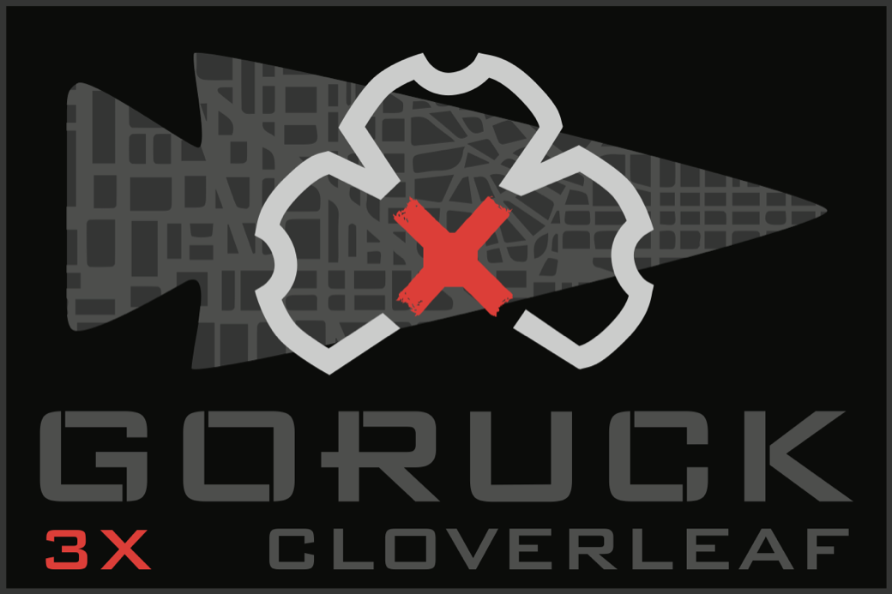
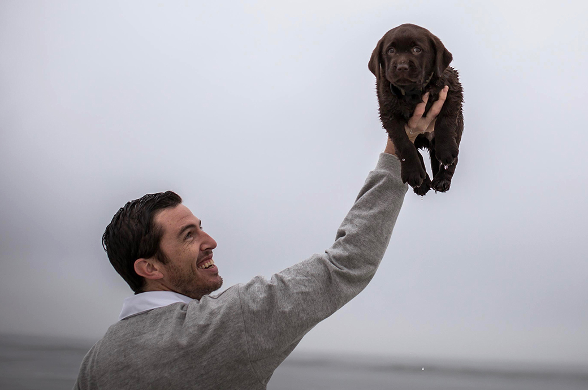
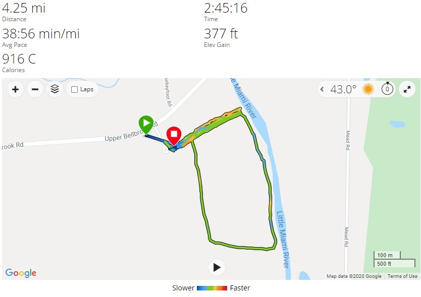

# Cloverleaf - Bellbrook, OH
09-19-2020

## Index
- [Cloverleaf - Bellbrook, OH](#cloverleaf---bellbrook-oh)
  - [Index](#index)
  - [Event Background](#event-background)
  - [Packing List](#packing-list)
    - [Gear](#gear)
  - [Event Location](#event-location)
  - [Cadre](#cadre)
  - [The Event](#the-event)
    - [Admin](#admin)
    - [Workouts](#workouts)
  - [Stats](#stats)
  - [Lessons Learned](#lessons-learned)
  - [What's Next?](#whats-next)

## Event Background

Grab a ruck, grab a sandbag, you choose the weight. Bring some friends or make some when you get there. Start outside, stay outside, spread out, turn the music up, do some hard work, ruck some miles, drink some beer when you’re done. This is how like minded people meet like minded people. By doing the work together.

Cloverleaf is a new event format that lets you choose how much challenge you want to take on.

- 3 Hours - MAX - Total
- 3 Workouts (capped at 30 minutes)
- 3 Movements (1-1.5 miles each) in between each workout

## Packing List
### Gear
* [Saucony Iso Ride 2](https://www.saucony.com/en/ride-iso-2/39110M.html#)
* [Darn Tough Light Hiker Micro Crew Light Cushion ](https://darntough.com/products/fw19-mens-light-hiker-micro-crew-light-cushion?variant=28842606428213)
* GORUCK Challenge Pants
* GORUCK Ruck Up T-Shirt
* GORUCK Performance Tack Hat
* 20L Rucker
  * 30lb GORUCK Plate
  * 3L Source Bladder
  * GORUCK Nalgene 
  * White Reflective Bands
  * [25kN Carabiner](https://www.amazon.com/gp/product/B073XS2KLJ/ref=ppx_yo_dt_b_search_asin_title?ie=UTF8&psc=1)
  * Phone
  * Garmin Watch
  * Hand Sanitizer
  * Mechanix Gloves
  * GORUCK Face Mask

## Event Location
>Jason's Dad's House, Bellbrook, OH

## Cadre
Cadre Jason

## The Event

### Admin

Before admin everyone watched in awe as Team Assessment was still going on and about 40 hours in. We watched the teams do various things up and down the infamous hill and down to the river. Those folks are amazing, no question. They were absolute machines.

### Workouts
Choose your weight, add/remove as needed and just do the work. 

**WOD #1 - “DT” USAF CCT**
5 rounds
* 12 Deadlifts
* 9 Hang Cleans
* 6 Press

4 down and backs to the river.

**WOD #2 - “Speedy Espericueta” Police**
18 minute AMRAP
* 13 Ruck High Pulls
* 44 Sit Ups
* 13 Ruck Push Ups
* 44 Flutter Kicks

1 lap around soy fields

**WOD #3 - The Will **
10 Rounds
* 10 Ruck Squats
* 10 American Ruck Twists
* 10 Ruck Push-Ups
* 10 Ruck High-Pulls

4 down and back to the river.

Buy out of 25 pushups and 25 squats as a team.

I pushed to do as much as I could with ruck on and most movements with SB.

The coolest part of this event was getting to be in the middle of Team Assessment, meeting Jason, and visiting Rucktopia aka Jason's Dad's house. Don't get me wrong the event itself was cool, but definitely overshadowed a little.

## Stats

## Lessons Learned
* The infamous hill is crazy, even more respect for TA participants.
  
## What's Next?
* Day of the Ranger double Tough in Washington, DC.
