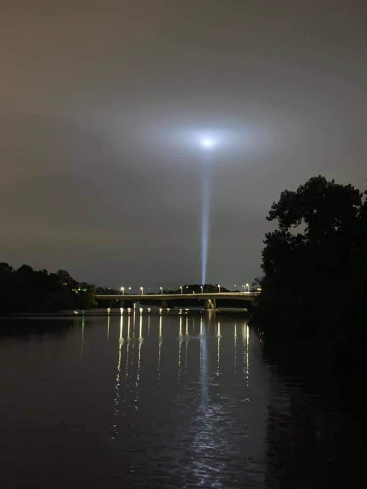
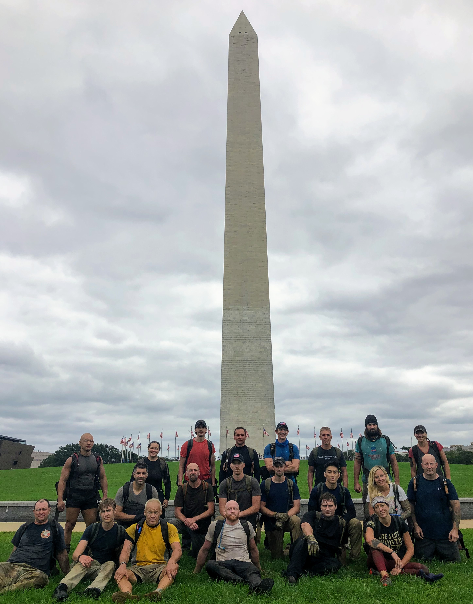
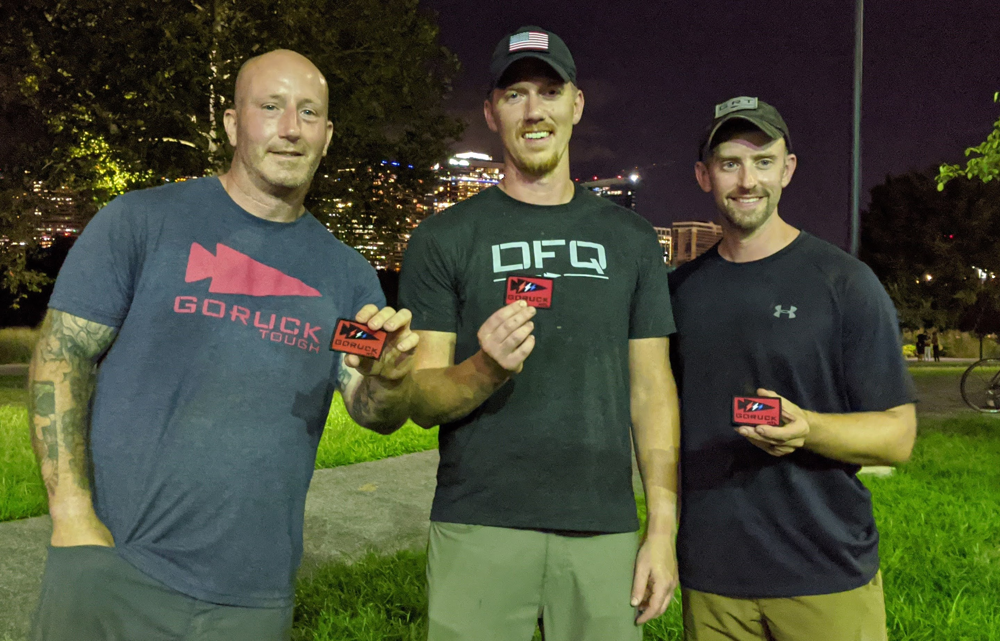

# 9/11 Memorial - HTL - Washington, DC
09/11/2020-09/13/2020

## Index
- [9/11 Memorial - HTL - Washington, DC](#911-memorial---htl---washington-dc)
  - [Index](#index)
  - [Event Background](#event-background)
  - [Packing List](#packing-list)
    - [Gear](#gear)
  - [Event Location](#event-location)
  - [Cadre](#cadre)
  - [The Events](#the-events)
    - [Heavy](#heavy)
      - [Admin](#admin)
      - [Welcome Party](#welcome-party)
      - [Movement](#movement)
      - [Shift Change](#shift-change)
      - [Endex](#endex)
      - [Heavy Post Event Priorities of Work:](#heavy-post-event-priorities-of-work)
    - [Tough](#tough)
      - [Pre Event Care](#pre-event-care)
      - [Admin](#admin-1)
      - [Welcome Party](#welcome-party-1)
      - [Movement](#movement-1)
      - [Endex](#endex-1)
      - [Tough Post Event Priorities of Work:](#tough-post-event-priorities-of-work)
    - [Light](#light)
      - [Pre Event Care](#pre-event-care-1)
      - [Admin](#admin-2)
      - [Welcome Party](#welcome-party-2)
      - [Movement](#movement-2)
      - [Endex](#endex-2)
    - [HTL Endex: BOLTS!!](#htl-endex-bolts)
  - [Lessons Learned](#lessons-learned)
  - [What's Next?](#whats-next)

## Event Background
9/11 DC

"One of the worst days in America’s history saw some of the bravest acts in America’s history. We’ll always honor the heroes of 9/11. And here at this hallowed place, we pledge that we will never forget their sacrifice."
— President George W. Bush at the Pentagon in 2008

The terrorist attacks of September 11, 2001, changed America and the lives of Americans forever. Our Cadre conduct 9/11 Commemorative events around the country to honor and remember those we lost: the courageous First Responders and the soldiers who fought in the Global War on Terrorism. Cadre and all willing participants will share their 9/11 story: where were you, how did it change your life? Never Forget.

## Packing List
### Gear

* [Saucony Iso Ride 2](https://www.saucony.com/en/ride-iso-2/39110M.html#)
* [Darn Tough Light Hiker Micro Crew Light Cushion ](https://darntough.com/products/fw19-mens-light-hiker-micro-crew-light-cushion?variant=28842606428213)
* GORUCK Challenge Pants x2, Eddie Bauer Trek Pants
* GORUCK T-Shirt, Under Armour Threadbone T-Shirt, Ruck Wrap T-Shirt
* Dick's Sporting Good Base Layer for Tough and Light
* GORUCK Performance Tack Hat
* 26L GR1 Multicam
  * 30lb Yes4All Plate, 20lb GORUCK Plate
  * 3L Source Bladder
  * GORUCK Nalgene 
  * Yellow Reflective Bands
  * [25kN Carabiner](https://www.amazon.com/gp/product/B073XS2KLJ/ref=ppx_yo_dt_b_search_asin_title?ie=UTF8&psc=1)
  * [Pelican 1060 Micro Case](https://www.amazon.com/gp/product/B0029Q7A1K/ref=ppx_yo_dt_b_asin_title_o00_s00?ie=UTF8&psc=1)
    * First Aid Kit
    * Quiter Cash
    * ID
    * Spare Batteries
    * Spare Socks
    * Phone
    * Garmin Watch
    * Body Glide
    * Spare Source Mouthpiece
  * Ziploc Baggie(s)
    * NUUN Tablets
    * Cliff Bars (4 x Heavy) (3 x Tough) (1 x Light)
    * Cliff Bloks + Caffeine (3 x Heavy) (2 x Tough) (1 x Light)
    * Beef Jerky (2 x Heavy) 
    * Trail Mix (2 x Heavy) (1 x Tough)
    * Mustard Packets
  * Hand Sanitizer
  * Mechanix Gloves
  * [Black Diamond Spot Headlamp](https://www.amazon.com/Black-Diamond-Spot-Headlamp-Size/dp/B06W54SBSL/ref=sr_1_4?dchild=1&keywords=black+diamond+headlamp+spot&qid=1578773865&sr=8-4)
  * Neck Gaiter
  * GORUCK Face Mask

## Event Location
>[Senator Charles H. Percy Plaza, Washington, DC](https://goo.gl/maps/WH1wVCfyk9oK9YX77)

## Cadre
Cadre Steve

Cadre L DB

## The Events

### Heavy

#### Admin
24 participants

We lined up in alphabetical order, failed and had to try again while bear crawling. Then we pilled our rucks up and line up about 50m away and did sprints, low crawls, and bear crawls through the mud to get items from the packing list. It helped to be fast here.

#### Welcome Party

This lasted about 4 hours, as my wife drove by around 10 and we were just getting read to head out. On one iteration of relay races while everyone else exercised we had to do a burpee with a lateral jump down and back. I was pushing hard to prevent people from doing more than they needed to. When I did the lateral jump midway down I hit mud and my feet went up in the air and busted my ass! It was pretty entertaining I am sure.

Rope PT was a new one for me, basically log PT but with rucks tied together with rope. All the same fun though with overhead presses, squats, lunges, and then burpees jumping over the rucks.

One of the next memorable iterations was American twists setting in a circle passing our rucks around the circle. We must have done 10 minutes of these as we couldn't get in synch. Although I saw video afterwards and we looked pretty damn good! We then did some flutter kicks to round things out.

We did farmer carries with two water jugs down and back about 25m. It pays to be a winner so I out right sprinted. I felt a pop in my knee where I had my ACL replaced but no pain so kept going. It never became a problem but it was in the back of my head the rest of the weekend.

#### Movement
Our first movement was to fill sandbags, with some very soft dirt and rocks. This really helped fill any gaps that just rock could leave behind! Bags definitely over their weight, at least in my mind.

I was assigned the ATL and when I counted everything up:
* 4 x 120s
* 4 x 80s
* 3 x 60s
* 2 x 40s
* 50# Firehose
* 4 x jerry cans
* 20# Thor’s Hammer
* 2 x flags
* Kit bag full of ropes
* Litter stretcher
> Several of the sandbags actually had bladders in them full of water. At least a 120 shell and a 60 shell.

For those counting at home that's 23 coupons and 24 participants. This was new territory for me as an ATL. We basically started switching heavy to light coupons and doubled up on the flag. We were still struggling of course. We tried a few iterations of the litter but could not get it to work for us.

We ended up going around Arlington Cemetary and out to Teddy Roosevelt Island. We were able to see the memorial lights shinning at the Pentagon as we crossed the bridge to the island.

#### Shift Change
At day break, L DB came in and we did our 12 miler in a park.
3 x 4 mile loops with a workout in between each lap:
* 9 x HR push-ups
* 9 x Ruck high pulls
* 9 x Ruck lat rows
* 9 x 4ct flutter kicks
* 9 x Ruck thrusters

We sacrificed our remaining break after the 12 miler to dump some sandbags. Fo each 10 minutes we could dump one sandbag. We dumped 4! That was an easy decision for us! 
We then rucked to Washington Monument did 47 8 count body builder for our missed time hack and got some sweet photos:

We then Rucked down the mall to top of Capital Hill, which is a big ass hill!
Just before we got the the Capital we got clever for a restroom break and things came full circle...

Back down the mall

We then stopped half way down for an egg race on the National Mall lawn!? Cadre L DB said if we did it with enthusiasm and did it well we could drop some more weight, hince my smile below!

We rocked that thing and almost had a 3 way tie! We were super into it, you can tell everyone was missing sports!

#### Endex
Movement back to endex:

Missed time hack to endex, paid with 125 4ct Flutter Kicks

Endex and beers!

24 began, 21 finished
40 miles covered in total in 24 hours

#### Heavy Post Event Priorities of Work:
* Ruck rash on lower back is straight raw
* Chafing down below is near unbearable
* Feet have no blisters but swollen a bit need to get off of them 

### Tough

#### Pre Event Care
My wife was absolutely amazing between event! I can't give her enough credit. She showed up with a Giant Jimmy John's sub I ate on the way back to the hotel. She swapped in my labeled food bags in for the tough, topped off my water, and then headed out to grab some diaper rash cream and base layers to help with the rubbing. This allowed me to shower and sleep almost an hour and half between heavy and tough. I was feeling really good with the base layer plus KT Tape on my ruck rash and the diaper cream was doing it's job. Back in it and ready to go!

#### Admin
24 participants

Reminiscent of the heavy with alphabetizing. We held up weight, quitter cash/ID, and water bladder over head without putting things down.

#### Welcome Party
Mud hole grows with more pt in it!
11 rounds of: 
* 9 x HR Push-ups
* 9 x Ruck swings
* 9 x Ruck squats
* 9 x 4 ct flutter kicks
  
Relay race of bear crawl and crab walk through the mud.
#### Movement
Headed to cathedral were we missed our time hack and paid with 55 burpees. From here we moved out for next movement of 3.1 miles given 1 hour 25 minutes. After about a half mile we turned around and headed back to cathedral. Not a good sign. We ended up doing 9 miles taking about 5 hours! Epic fail! We ended up at a cool bridge over the Potomac River and did 384 ruck squats as a team to pay. Cadre Steve said we needed to book it back to endex to get there on time, he was leading so keep up. I was intrusted with Thor's hammer as ATL to Cadre Steve where I kept track on the back to keep us together. We attempted a trail that seemed to have been washed out. On the way down we dropped all sandbags as it was pretty sketchy, but it gave us this sweet team picture!

#### Endex
This last movement back to endex was 6 miles at brisk pace. I bore the weight of leadership the whole time with the 20lb Thor Hammer, which started to get to me towards the end. My feet were feeling it at the end of this, no blisters, just beat up.

25 started, 22 finished
17 miles in total

#### Tough Post Event Priorities of Work:
* Previous work done paid off, body feels good.
* Feet are beat up need to elevate.

### Light

#### Pre Event Care
I done messed up. I was riding high off finishing two events and was ready for the victory lap. I took ibuprofen and laid down. Missing a big piece of the puzzle of nutrition! I was planning to wake up and slam breakfast. Instead I woke up shaking and needing to throw up. I chugged pedialyte and water in an attempt to right the ship. I also started shoveling in calories. Luckily about 10 minutes before leaving I was feeling decent, and felt pretty good by admin. Priorities of work were off and I almost missed my bolts because of it!

#### Admin
47 Participants

Pattern established alphabetizing, and hold the required items overhead. At this point I have my ID and quitter cash in pocket. While everyone scrambles for it, I calmly pull it from my pocket and stand there. Cadre Steve gave a smirk at this.

#### Welcome Party
Relay races of bear crawl and crab walks in the very nice mud pit we have created at this point.
#### Movement
Headed to the Lincoln Memorial and did a 12 laps up and down for the 110 stories in the World Trade Center.

Afterwards we headed to the backside of the Capital and back. The Light class was amazing. Us HTL'ers had to steal coupons from them to earn our Light patch! A group of us grabbed a 120 and 80 and started rotating them. We made sure we earned that last patch!

#### Endex
We dumped sandbags and Cadre Steve ran around to find us some beer to bring to endex.

47 people started, 47 finished
9 miles covered

### HTL Endex: BOLTS!!
Earned them bolts!! A surreal moment that I have looked forward to ever since I watched HTL'ers get theirs during my first TL weekend.

Kyle, Matt, and I met up over Facebook and did HDT together. Always pushing each other and making sure we got those bolts.

Matt and I did our first event together, it was fitting to earn our bolts together!

STRONG HTL group, we crushed it!

## Lessons Learned
* Foot prep was great, Tuf Feet and miles resulted in zero blisters!
* Holy chafing! Tape, Compression, and Diaper Rash Cream were key for me.
* My pit crew between events was amazing and deserves soo much credit, my wife rocks!!!

## What's Next?
* Cloverleaf depending on how I heal in the next week.
