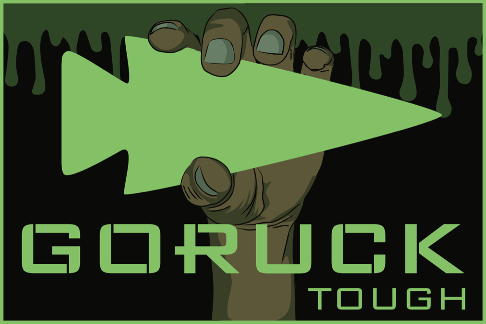
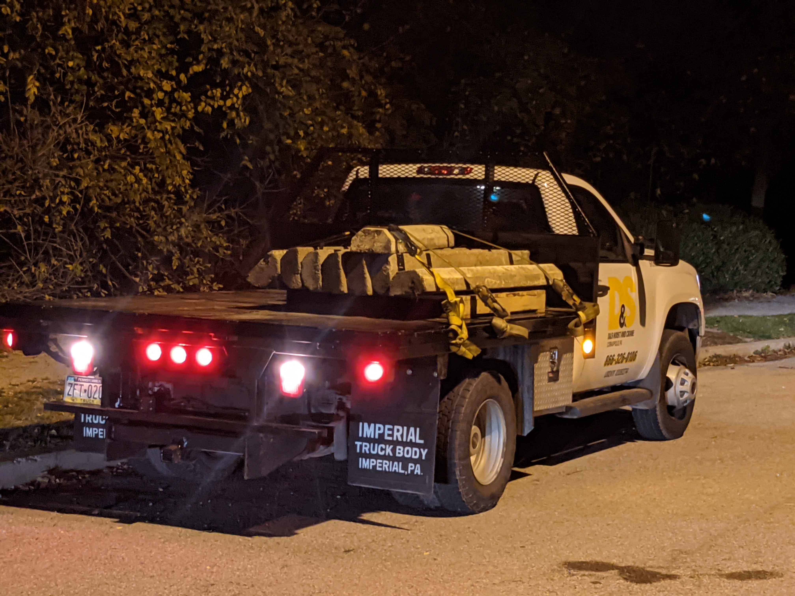
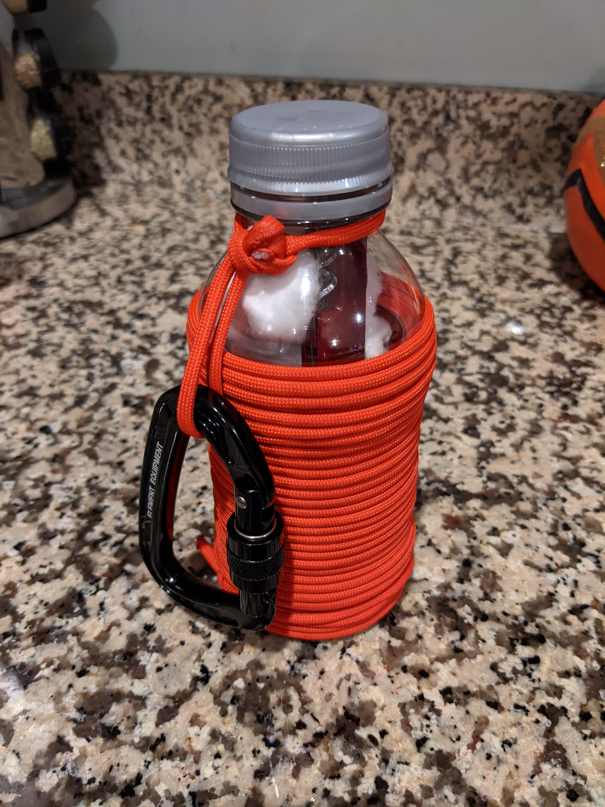
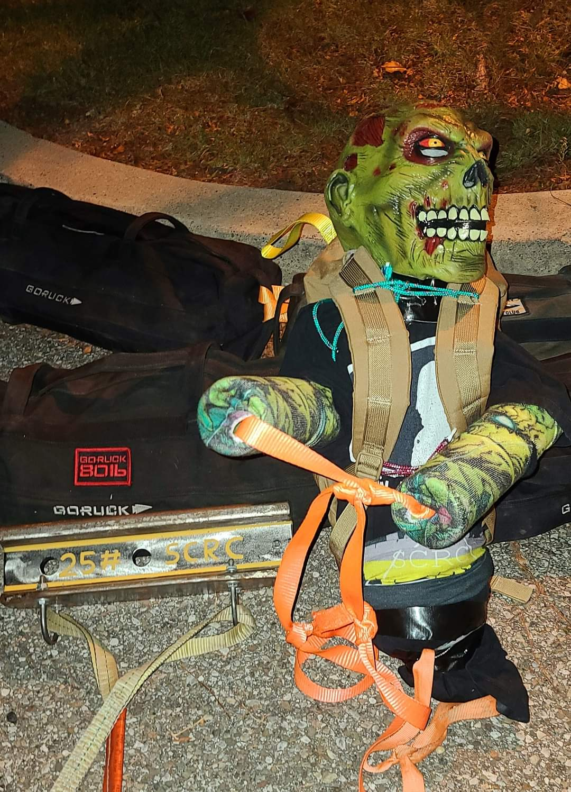
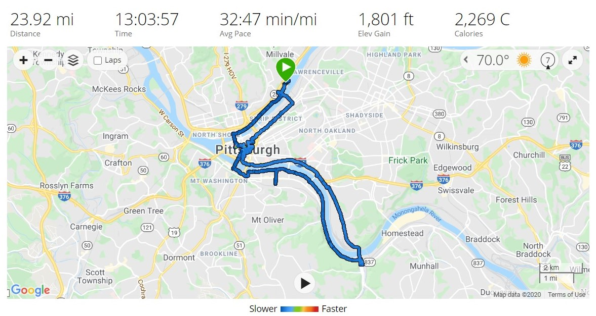

# Zombie - Tough - Pittsburgh, PA 
07-17-2020

## Index
- [Zombie - Tough - Pittsburgh, PA](#zombie---tough---pittsburgh-pa)
  - [Index](#index)
  - [Event Background](#event-background)
  - [Packing List](#packing-list)
    - [Gear](#gear)
  - [Event Location](#event-location)
  - [Cadre](#cadre)
  - [The Event](#the-event)
    - [Admin](#admin)
    - [Welcome Party](#welcome-party)
    - [Movement](#movement)
    - [Endex](#endex)
  - [Stats](#stats)

## Event Background
Zombie Apocalypse
"Okay, it's pretty obvious what we're doing here, people. If it's dead–fucking KILL IT."
– Robert Kirkman, The Walking Dead

Life is hard, it will be harder when the zombies show up. This event will get you ready not only to fight off the undead but teach you to thrive in the post-apocalyptic wasteland.

## Packing List
### Gear
* [Saucony Iso Ride 2](https://www.saucony.com/en/ride-iso-2/39110M.html#)
* [Darn Tough Light Hiker Micro Crew Light Cushion ](https://darntough.com/products/fw19-mens-light-hiker-micro-crew-light-cushion?variant=28842606428213)
* GORUCK Challenge Pants
* GORUCK T-Shirt
* DSR Base Layer
* GORUCK Performance Tack Hat
* 26L GR1 Multicam
  * 30lb Yes4All Plate
  * 3L Source Bladder
  * GORUCK Nalgene 
  * Yellow Reflective Bands
  * [25kN Carabiner](https://www.amazon.com/gp/product/B073XS2KLJ/ref=ppx_yo_dt_b_search_asin_title?ie=UTF8&psc=1)
  * [Pelican 1060 Micro Case](https://www.amazon.com/gp/product/B0029Q7A1K/ref=ppx_yo_dt_b_asin_title_o00_s00?ie=UTF8&psc=1)
    * First Aid Kit
    * Quiter Cash
    * ID
    * Spare Batteries
    * Spare Socks
    * Phone
    * Garmin Watch
  * Ziploc Baggie
    * NUUN Tablets
    * Two Cliff Bars
    * One pack of Cliff Bloks + Caffeine
    * Uncrustable PB+J
  * Hand Sanitizer
  * Mechanix Gloves
  * [Black Diamond Spot Headlamp](https://www.amazon.com/Black-Diamond-Spot-Headlamp-Size/dp/B06W54SBSL/ref=sr_1_4?dchild=1&keywords=black+diamond+headlamp+spot&qid=1578773865&sr=8-4)
  * Neck Gaiter
  * GORUCK Face Mask

## Event Location
>[Herrs Island (meet vicinity of Washington's Landing)](https://goo.gl/maps/Rsd8LtPfqozoCGx5A)

## Cadre
Cadre Steve

## The Event

### Admin

I drove up before hand and closed my eyes for about an hour before hand, no sleep though. Gathered in the parking lot at the end of the park with everyone. Cadre Steve came rolling up in his car followed by this: 

Cadre Steve then stood on the bed for admin, nothing too crazy. I think once we weren't moving fast enough to grab gear and he dropped us for some pushups. We also had to hold up our homemade survival tool. Here is my glorified fire starter with  lots of paracord:

He then informed us that the rest of the night was in our hands. We need to transport the vaccines in cased in the the concrete blocks on the truck, need to be delivered to the drop sight. Our sound, light, and movements can attract zombies, so be careful.

### Welcome Party
We then unloaded all of the parking blocks and moved them to a nearby field, maybe 300 yards away. During that distance most groups took two or three breaks. This was not a good sign. We stacked all 8 up in the field and proceeded to line up. For the PT we did bear walks down 50 yards, 10 Burpees, and then crab walk back. This was done as a relay race between two teams. The others waiting did exercises Cadre Steve called out like:
* Overhead ruck squats
* Overheard ruck hold
* Bear hug ruck hold
* Pushups
* Ruck Swings
* 4 ct flutter kicks
* Ruck Swings
* Others

### Movement

Cadre Steve gave us the drop point and we needed to navigate ourselves there. Cell towers, wifi, and GPS are out in this apocalypse. We needed to resort to paper maps and compasses to track down the point and path. The challenge was we couldn't take any paths we already took, since the zombies would be following and be on those paths already. After sometime we found our point and headed out. Thankfully we only had to take 3 vaccines cases, which was still crazy heavy. We found out afterwards each was 230+ pounds each. Besides that we had a few 80s, lots of 60s, a stretcher, a water jug, and our zombie friend team weight:

### Endex 

## Stats

