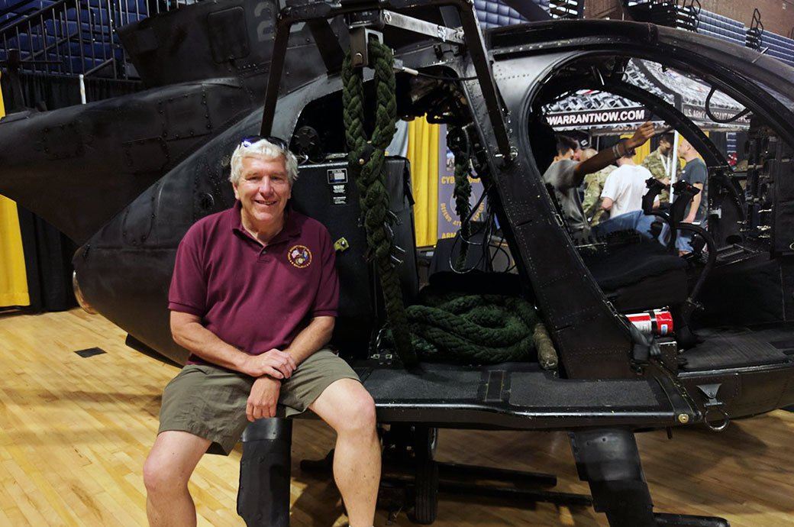

# Day of the Ranger - TT - Washington, DC
10/03/2020-10/04/2020

## Index
- [Day of the Ranger - TT - Washington, DC](#day-of-the-ranger---tt---washington-dc)
  - [Index](#index)
  - [Event Background](#event-background)
  - [Packing List](#packing-list)
    - [Gear](#gear)
  - [Event Location](#event-location)
  - [Cadre](#cadre)

## Event Background
Day of the Ranger

In late August of 1993, an elite special operations force called Task Force Ranger (TFR) was deployed to Mogadishu, Somalia to find and capture a criminal warlord named Muhammed Farrah Aideed. TFR was un-precedented and formidable fighting force made up of the US Army’s Delta Force Commandos, US Army Rangers from the 3rd Ranger Battalion of the 75th Ranger Regiment, Air Force Operators, Navy SEALS and the Nightstalker helicopter crews of the US Army’s 160th Special Operations Air Regiment. On the 3rd of Oct, TFR launched a daring daylight raid into downtown Mogadishu where 21 Aideed's top officials were meeting in secret. While the initial raid was a success two Blackhawk helicopters would be shot down while the assault force, with its prisoners, were waiting for extraction! The mission now changed from a find and capture mission to a rescue mission for the downed members of the two crashed Blackhawks. This rescue would turn into the 18 hour Battle of Mogadishu or as Somalia’s were to name it! The Day of the Ranger. The heroics of the men in TFR both from the air and on the ground, fighting to save each other, is an extraordinary story of courage, perseverance and commitment and this event will commemorate the bravery of those both fallen and living who took part in this battle.

The first Tough will begin at 21:00 on 10/2/19

The second Tough will begin at 15:00 on 10/3/19

You must complete both Tough events to earn the coveted Day of the Ranger patch.

## Packing List
### Gear
* [Saucony Iso Ride 2](https://www.saucony.com/en/ride-iso-2/39110M.html#)
* [Darn Tough Light Hiker Micro Crew Light Cushion ](https://darntough.com/products/fw19-mens-light-hiker-micro-crew-light-cushion?variant=28842606428213)
* GORUCK Challenge Pants x2, Eddie Bauer Trek Pants
* GORUCK T-Shirt, Under Armour Threadbone T-Shirt, Ruck Wrap T-Shirt
* Dick's Sporting Good Base Layer for Tough and Light
* GORUCK Performance Tack Hat
* 26L GR1 Multicam Custom w/ Bottom Handle and Drain Holes
  * 30lb Yes4All Plate, 20lb GORUCK Plate
  * 3L Source Bladder
  * GORUCK Nalgene 
  * Yellow Reflective Bands
  * [25kN Carabiner](https://www.amazon.com/gp/product/B073XS2KLJ/ref=ppx_yo_dt_b_search_asin_title?ie=UTF8&psc=1)
  * [Pelican 1060 Micro Case](https://www.amazon.com/gp/product/B0029Q7A1K/ref=ppx_yo_dt_b_asin_title_o00_s00?ie=UTF8&psc=1)
    * First Aid Kit
    * Quiter Cash
    * ID
    * Spare Batteries
    * Spare Socks
    * Phone
    * Garmin Watch
    * Body Glide
    * Spare Source Mouthpiece
  * Ziploc Baggie(s)
    * NUUN Tablets
    * Cliff Bars (4 x Heavy) (3 x Tough) (1 x Light)
    * Cliff Bloks + Caffeine (3 x Heavy) (2 x Tough) (1 x Light)
    * Beef Jerky (2 x Heavy) 
    * Trail Mix (2 x Heavy) (1 x Tough)
    * Mustard Packets
  * Hand Sanitizer
  * Mechanix Gloves
  * [Black Diamond Spot Headlamp](https://www.amazon.com/Black-Diamond-Spot-Headlamp-Size/dp/B06W54SBSL/ref=sr_1_4?dchild=1&keywords=black+diamond+headlamp+spot&qid=1578773865&sr=8-4)
  * Neck Gaiter
  * GORUCK Face Mask

## Event Location
>[Founders Park, Alexandria, VA](https://goo.gl/maps/D35mGa5FRRK2yyDG6)

## Cadre
Cadre Igor

Cadre Belman

Cadre Whiskey Mike

64 started, 62 completed

Tough 1
* Start at 9pm
* 64 people started
* Split into 3 troops, I was troop 1 with 21 people
* Commander, Sergeant Major, Troop Leader, Assistant Troop Leader
* Radio for leadership
* Welcome party
  * Ruck on 19 counts for
    * 4ct Pushups
    * 4ct flutter kicks
    * Overhead Squats
    * Bear Crawl 38 steps out and back
* Filled sandbags in nearby volleyball court then divided them along with team weights(ranger tab, SF tab, tail rotor, range script, blackhawk chain, logs, axe, 3 flags, 3 water jugs, 4 120s and more)
* 1st Movement cut short to grab a quick picture just like Delta's first mission
* Discussed team communications and distributed radios to help
* Swarmed by 3 cop cars as leaving the park
* Movement to lincoln memorial via Jefferson Memorial, Washington Memorial, and WWII Memorial in route.
* Got cold and windy
* First event was training and expectation setting for second event
* Endex:
  * No patch
  * Troops responsible for troops coupons between events
  * Be back and ready to go at 3 
  * Endexed at 8:30

Tough 2
63 started
* Started promptly at 3, as a troop we decided to show back up at 2:20 to organize and get ready.
* Welcome party:
  * Each troop did a given exercise for an unknown time:
    * 4ct Ruck Pushups
    * Ruck Swings
    * Ruck Squats
    * Ruck thrusters
    * Overhead Ruck Squats
  * Ruck up, weight up, get it on, IRENE.
  * Movement through harbour area to park under bridge
  * At park we did relay races between troops through mud in field. 120# SB run out to ranger tab, low crawl back, next 2 low crawl out to SB and run back, repeat for everyone. My troop lost and headed to the mud hole for some muddy 4ct pushups. Everyone else joined and Cadre Igor appreciated that and rewarded us for it.
  * Long movement to The George Washington Masonic National Memorial through town with lots of stop lights, very challenging with 63 folks.
  * Next movement was an aggressive time hack of 2 miles 40 minutes. Ran the last half mile. Ended up at a basketball court with restrooms. Shadows brought a large pizza for themselves and cadre and ate in front of us, sick torture of some sort.
  * Great conversation from all 3 cadre:
    * IGOR- Delta
    * Belman - CSAR 
    * Whiskey Mike - Chalk 4 
    * Very cool to hear the story triangulated from 3 completely different perspectives. Getting to see the Cadre learn new things from each other was really eye opening to focus each had on their parts of the mission.
  * Movement to next area, stopped for use of tree line, start back up to immediately ground things. Had a med issues. Ambulance shows up to check them out and clear them. Then plategate+rookie, integrity drop.
  * I become commander, and we have a 4 mile Movement down to path in middle of nowhere and read additional bios, read mine for Staff Sergeant Daniel Busch. Cold setting in, second tough hitting me, start dozing off unintentionally.
  *  Movement backtracking a bit towards 4 mile run park. Fill water up since everyone is black, read more bios. Everyone is in rough shape, few people crying some people contemplating dropping. Sun starts to peak, and Cadre Igor gives the news we are heading back to index. Another 4 mile movement. He gives us the chance to earn dropping sandbags with some trivia questions and we mercifully get 2 out 3 required to do so. 
  * Long final movement back to endex, moving a little slow but steadily.
  * Endex!
    * Coveted Day of The Ranger patch earned, plus bonus OG Tough patch for the first tough.
    * Beers, photos, and so longs.

Lessons learned:
* Need antacids packed, too many cliff bloks/bars give me enough acid to throw up.
* Pack some real food next time for the moral pick me up
* Need to give myself more time between events to fully appreciate them, got a little burned out during the events.

